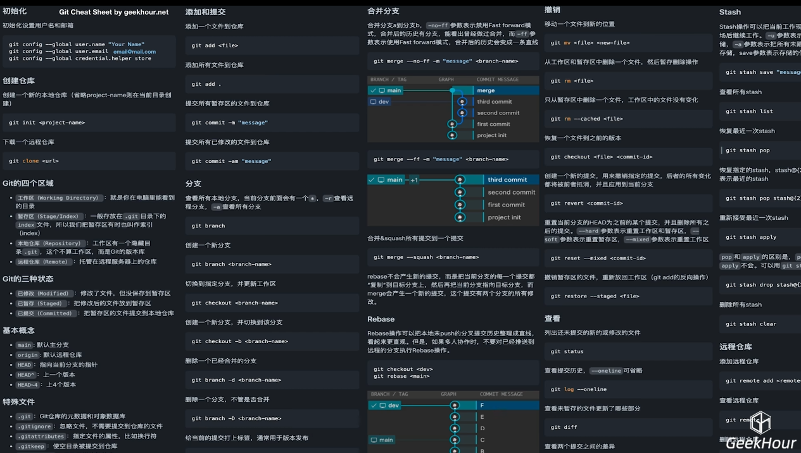
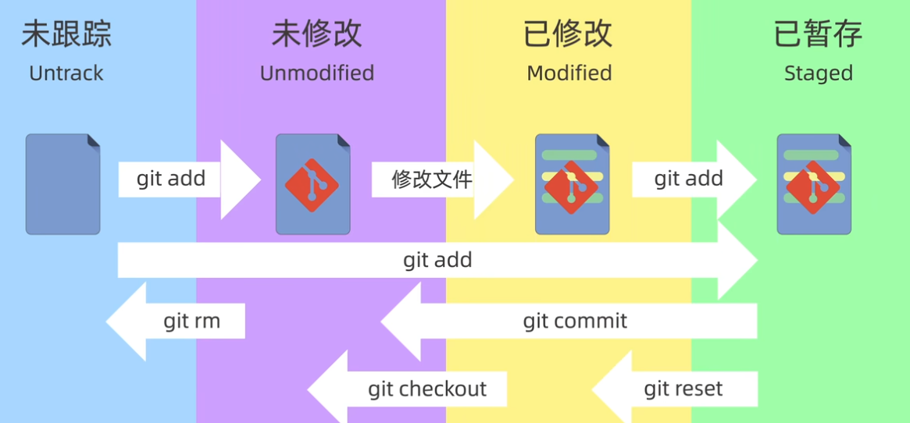
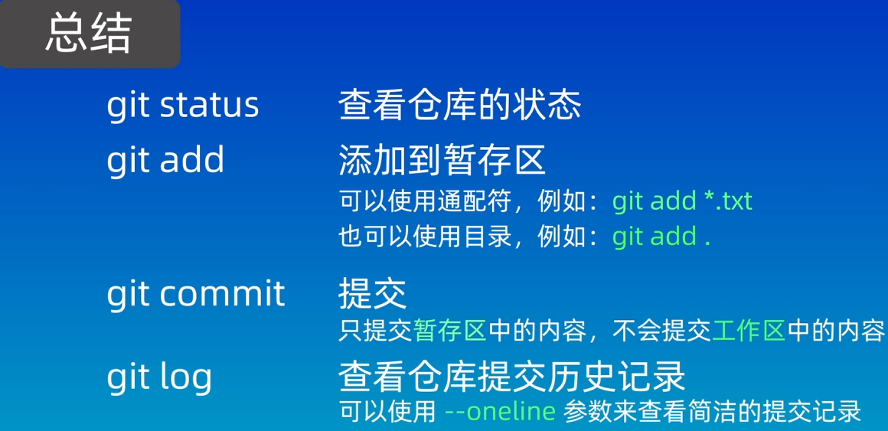
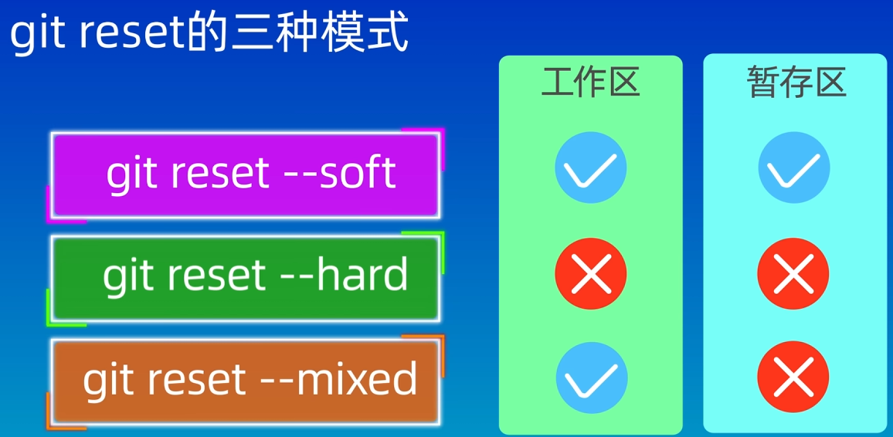
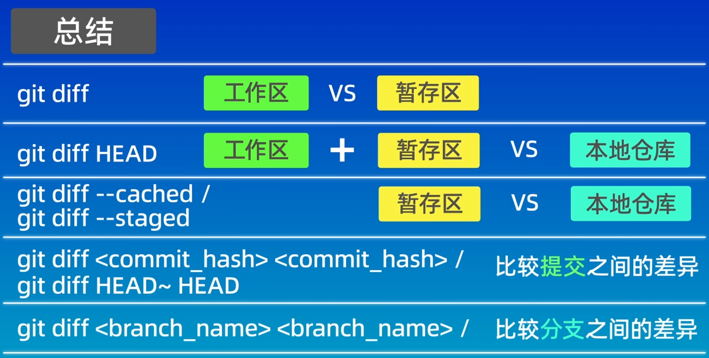
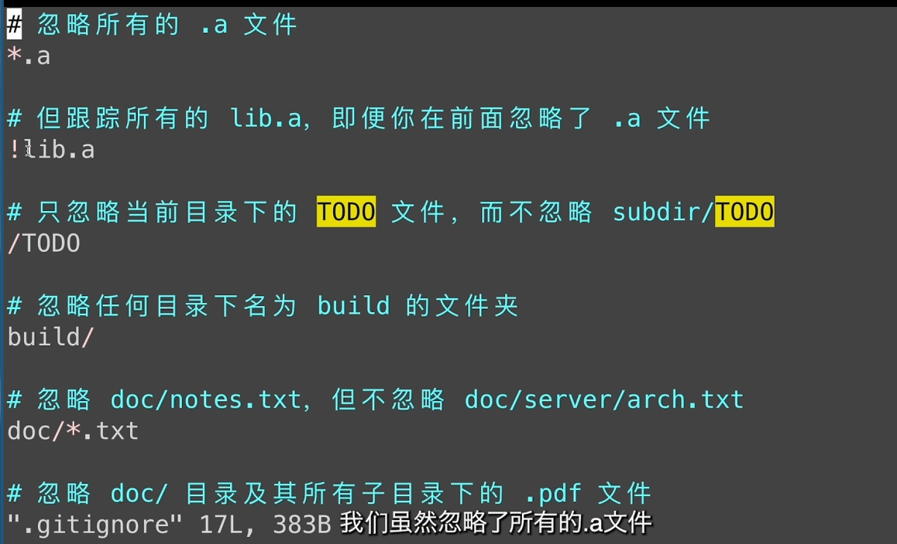

#### 使用命令来创建一个仓库
```
  mkdir learn-git(目录名)
  cd learn-git
  git init
```
==git init 创建仓库==

#### 工作区域


#### 文件状态


git status 

#### 添加和提交文件


#### git reset 回退版本


ls 查看工作区的内容
git ls-files 查看暂存区的内容

git reflog 查看操作历史版本
git reset --模式 版本号

#### git diff 查看差异

- 不加参数默认比较工作区和暂存区:
git diff 的差异

- 比较工作区和版本库的差异:
git diff HEAD

- 比较暂存区和版本库的差异:
git diff --cached

- 比较两个版本之间的差异:
git diff 版本号1 版本号2

- 查看当前版本和上一个版本之间的差异:
  HEAD指针指向分支的最新提交节点

  git diff HEAD~ HEAD

  HEAD^2 HEAD之前的两个版本
- 针对某一个文件查看修改前后的差异
  git diff HEAD~3 HEAD file3.txt

- 查看分支间的差异



#### git rm删除文件

git rm 直接删除工作区和暂存区的内容,需要提交到本地仓库

#### git ignore 忽略文件


vi .gitignore 
*.log
之后就可以忽略所有的日志文件
temp/
忽略文件夹中的内容




