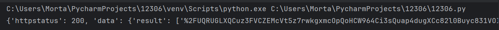

#### 代码实现步骤
***
**requests模块:**

1.发送请求:模拟浏览器对于url地址发送请求
2.获取数据:回去服务返回响应数据
3.解析数据:提取需要的内容
4.保存数据:把提取的数据保存在本地文件中

>主要实现查票功能,不需要对应数据信息的保存

不使用requests模块,改为使用**drissionpage模块**:

>模拟人的行为对于浏览器进行相应的操作

1.打开浏览器,访问网站
2.获取数据
3.解析数据
4.保存数据

*使用包:*
>from DrissionPage import ChromiumOptions
请改为你电脑内Chrome可执行文件路径
path = r'C:\Program Files\Google\Chrome\Application\Chrome.exe'
ChromiumOptions().set_browser_path(path).save()

不更改Google浏览器位置时不需要重新配置

**1.打开浏览器访问网站,输入相关信息进行查票**
```
# 导入自动化模块
from DrissionPage import ChromiumPage
# 导入动作链方法
from DrissionPage.common import Actions
# 打开浏览器
dp=ChromiumPage()
# 实例化动作对象
ac=Actions(dp)
# 访问网站
dp.get('https://kyfw.12306.cn/otn/leftTicket/init')
# 输入出发地
ac.move_to('css:#fromStationText').click().type('xianbei\n')
# 输入目的地
ac.move_to('css:#toStationText').click().type('lanzhou\n')
# 输入出发时间
dp.ele('css:#train_date').clear().input('2025-10-01')
# 点击查询
dp.ele('css:#query_ticket').click()
```

**2.获取车辆信息**

<u>监听数据</u>

监听数据包特征,是当网站加载含有特征数据接口,直接获取响应数据



```
dp.listen.start('leftTicket')
# 等待数据包加载
resp=dp.listen.wait()
# 获取响应数据
json_data=resp.response.body
print(json_data)
```

**解析