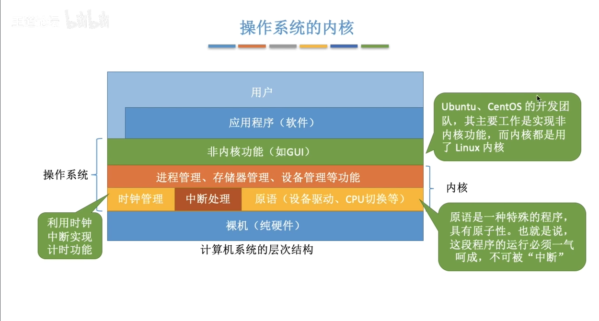

# title
## title

普通文本
***
## 引用 
>引用的内容
>>嵌套的内容
***
## 列表
### 无序列表
- 列表一
- 列表二

### 有序列表
1. 列表一
2. 列表二
***
todolist
- [ ] a
- [ ] b
***
## 表格
|左对齐|居中对齐|右对齐|
|:-----|:-----:|----:|
|a|b|c|
***
|字体|代码|
|:--:|:--:|
|*斜体*|* *|
|==高亮==|== ==|
|**粗体**|** **|
|***斜粗体***|*** ***|
|~~删除~~|~~ ~~|
|<u>下划线</u>|<u> </u>|

- 脚注
  跳转到注解[^1]处
***
```
# include<iostream>

int main(){
    print(hello world)
}
```
***
### 超链接
[链接](https://www.bilibili.com/video/BV1bK4y1i7BY/?spm_id_from=333.337.search-card.all.click&vd_source=46314c5b70240e18a09e4ce2de7a43dc)

***
### 图片

- 使用html调整图片的大小和位置
  
[^1]:文中多次提及的东西
