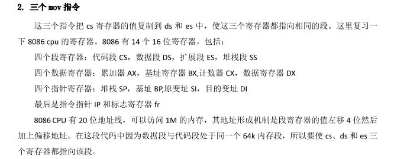
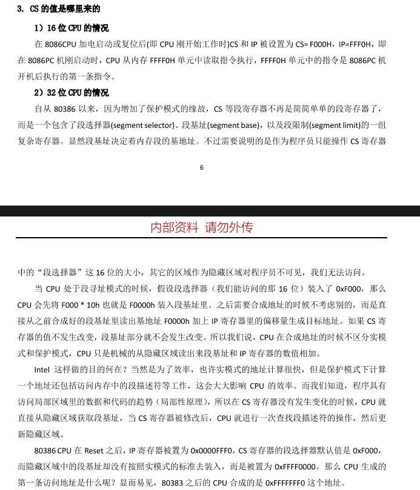
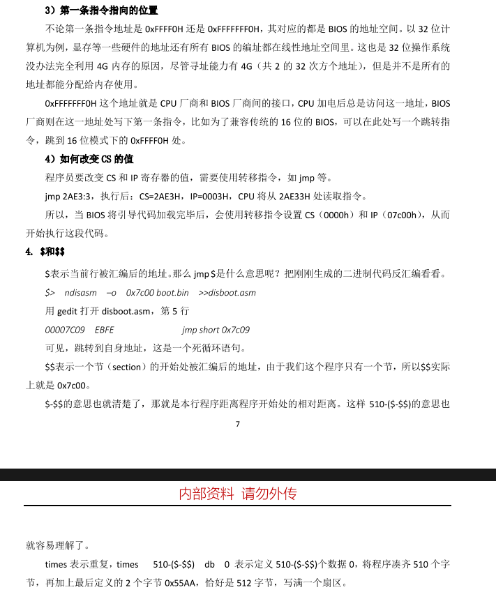
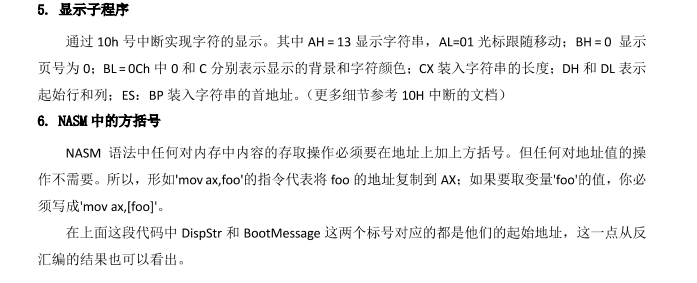

# 第一章 搭建GeekOS实验环境详解

## 📖 章节概述
第一章是GeekOS实验的入门指南，重点讲解如何搭建一个完整的操作系统开发环境。通过本章学习，你将掌握Ubuntu系统的安装、必要开发工具的配置，并亲手编写和运行一个最小的操作系统引导程序。这是后续所有GeekOS项目的基础，扎实的环境搭建是成功的关键。


## 💻 1.1 安装Ubuntu操作系统

### 为什么选择Ubuntu？
Ubuntu是一个基于Debian的Linux发行版，以其易用性和强大的社区支持而闻名。对于GeekOS开发来说，Ubuntu提供了稳定的开发环境和丰富的软件包管理工具，非常适合初学者和进阶用户。

### 安装步骤详解
1. **虚拟机安装（推荐方案）**
   - 使用VMware Workstation Player创建新虚拟机
   - 选择"稍后安装操作系统"以便更灵活配置
   - 编辑虚拟机设置，指定Ubuntu镜像文件

2. **Ubuntu系统安装**
   - 启动虚拟机，开始Ubuntu安装过程
   - 选择语言、时区，创建用户账户
   - 分区建议：使用默认设置或手动分配20GB以上空间

3. **安装VMware Tools**
   - 实现主机与虚拟机间的文件共享
   - 支持鼠标自由移动和屏幕全屏化
   - 通过Player菜单选择"安装VMware Tools"

4. **修改更新源（关键步骤）**
   ```bash
   # 备份原有源列表
   sudo cp /etc/apt/sources.list /etc/apt/sources.list_backup
   # 编辑源列表文件
   sudo gedit /etc/apt/sources.list
   ```
   - 将内容替换为old-releases仓库地址
   - 执行`sudo apt-get update`刷新软件列表

### 注意事项
- 虚拟机分配内存建议不少于2GB
- 确保网络连接正常以下载更新和软件包
- 安装过程中遇到问题可查阅Ubuntu官方文档

## 🔧 1.2 安装必要的软件工具

### 开发工具套装
GeekOS开发需要一系列专业工具，每个工具都有特定用途：

1. **文本编辑器 - gedit**
   - 设置方法：编辑→首选项→插件，激活所需插件
   - 代码高亮：查看→高亮模式，选择C/C++
   - 侧边栏：查看→勾选侧边栏，方便文件导航

2. **编译工具链**
   - GCC编译器：`sudo apt-get install gcc`
   - NASM汇编器：需要特定版本2.08.02
   ```bash
   # 下载并编译安装nasm 2.08.02
   wget http://www.nasm.us/pub/nasm/releasebuilds/2.08.02/nasm-2.08.02.tar.gz
   tar -zxvf nasm-2.08.02.tar.gz
   cd nasm-2.08.02
   ./configure
   make
   sudo make install
   ```

3. **Bochs虚拟机**
   - 必须从源码编译安装以支持调试功能
   - 安装依赖包：xorg-dev、build-essential等
   - 配置参数：`./configure --enable-gdb-stub`

4. **调试工具**
   - GDB：命令行调试器，功能强大
   - DDD：GDB的图形前端，更适合初学者

### 工具验证
安装完成后，在终端中依次运行`gcc`、`nasm`、`bochs`等命令，确认工具正常可用。

## 🐧 1.3 使用高版本的Linux系统

### 版本兼容性问题
新版本Ubuntu自带的GCC版本较高，可能无法正确编译GeekOS代码。这是因为GeekOS项目发布于2005年，针对当时的编译器版本优化。

### 解决方案
1. **GCC降级**
   ```bash
   # 添加旧版本仓库
   sudo add-apt-repository 'deb http://archive.ubuntu.com/ubuntu/trusty main'
   sudo add-apt-repository 'deb http://archive.ubuntu.com/ubuntu/trusty universe'
   # 安装gcc-4.4
   sudo apt install gcc-4.4
   # 对于64位系统，还需要32位库
   sudo apt install gcc-4.4-multilib libc6-dev-i386
   ```

2. **配置编译器选项**
   ```bash
   # 设置gcc版本切换
   sudo update-alternatives --install /usr/bin/gcc gcc /usr/bin/gcc-4.4 40
   sudo update-alternatives --install /usr/bin/gcc gcc /usr/bin/gcc-7 70
   # 切换版本
   sudo update-alternatives --config gcc
   ```

3. **修改Makefile**
   - 为gcc增加`-m32`参数生成32位代码
   - 为ld增加`-m elf_i386`参数
   - 这些修改确保在64位系统上正确编译32位GeekOS

## 🚀 1.4 一个最小的操作系统

### 动手实践：编写引导扇区
这个实践项目将带你创建第一个"操作系统"——一个简单的引导程序，在启动时显示"Hello, OS world!"。

**创建boot.asm文件：**
```nasm
org 07c00h          ; 告诉编译器程序加载到0x7c00处
mov ax, cs          ; 设置数据段与代码段相同
mov ds, ax
mov es, ax
call DispStr        ; 调用显示字符串例程
jmp $               ; 无限循环，$表示当前地址

DispStr:
    mov ax, BootMessage
    mov bp, ax          ; ES:BP = 串地址
    mov cx, 16          ; CX = 串长度
    mov ax, 01301h      ; AH=13(功能号), AL=01h(写入模式)
    mov bx, 000ch       ; 页号为0(BH=0), 属性=黑底红字(BL=0Ch,高亮)
    mov dl, 0           ; 列号=0
    int 10h             ; 调用BIOS 10h中断
    ret

BootMessage: db "Hello, OS world!"
times 510-($-$$) db 0   ; 填充剩余空间
dw 0xaa55               ; 引导扇区结束标志
```

### 编译和运行步骤
1. **编译汇编代码**
   ```bash
   nasm boot.asm -o boot.bin
   ```
   - 生成512字节的二进制文件
   - 使用`ls -l`确认文件大小正确

2. **创建磁盘镜像**
   ```bash
   dd if=boot.bin of=a.img bs=512 count=1 conv=notrunc
   ```
   - dd命令将boot.bin写入a.img的第一个扇区
   - bs=512设置块大小，count=1表示只写一个块

3. **配置Bochs**
   - 创建bochsrc配置文件
   - 添加：`floppya: 1_44=a.img, status=inserted`
   - 运行：`bochs -f bochsrc`

[查看bochsrc配置文档说明](bochsrc.md)


### 代码深度解析
1. **为什么是0x7C00？**
   - 历史原因：早期IBM PC 5150只有32KB内存
   - BIOS将引导扇区加载到内存最高端的1KB空间（32KB-1KB=31KB=0x7C00）

2. **段寄存器设置**
   - 8086 CPU使用段地址:偏移地址方式寻址
   - 设置DS、ES与CS相同，确保数据访问正确

3. **BIOS中断调用**
   - INT 10H是BIOS的视频服务中断
   - AH=13H表示显示字符串功能
   - 其他参数设置显示属性和位置

4. **引导扇区标志**
   - 最后两个字节必须是0x55AA
   - BIOS通过这个标志识别可启动设备
   - 注意汇编代码中写入的是0xAA55（小端序）


### 重要知识点





## 📚 阅读材料：计算机启动过程详解

### 计算机启动的四个阶段
1. **BIOS阶段**
   - 电源接通，CPU从FFFF:0000H开始执行
   - BIOS进行POST（加电自检）
   - 检测硬件设备，初始化系统

2. **主引导记录（MBR）阶段**
   - BIOS读取设备第一个扇区（512字节）
   - 检查最后两个字节是否为0x55AA
   - 将控制权交给引导程序

3. **引导加载程序阶段**
   - 如GRUB等引导管理器
   - 加载操作系统内核到内存
   - 传递启动参数

4. **操作系统初始化阶段**
   - 内核接管控制权
   - 初始化系统服务和设备驱动
   - 启动用户空间进程

### 技术细节
- **引导扇区结构**：前446字节为代码，中间64字节为分区表，最后2字节为标志
- **分区类型**：主分区、扩展分区、逻辑分区
- **现代UEFI启动**：与传统BIOS启动有显著区别

## 💡 思考与练习

### 实践题目
1. **引导扇区标志问题**
   - 问题：引导扇区的标志是0x55AA，为什么代码中写入的却是dw 0xAA55？
   - 提示：考虑CPU的字节序（Endianness）

2. **创意引导程序**
   - 任务：修改boot.asm，创建一个有创意的启动扇区
   - 建议：改变显示信息、颜色或添加简单动画

3. **环境搭建验证**
   - 检查所有工具是否正确安装
   - 尝试编译和运行GeekOS的project0


### 深入思考
1. 如果引导扇区大于512字节会发生什么？
2. 为什么需要将引导程序从0x7C00复制到其他位置？
3. 现代操作系统启动过程与本文描述的有何不同？

通过本章的学习，你已经掌握了GeekOS开发环境的搭建方法，并理解了计算机启动的基本原理。这些知识为后续的操作系统深入开发奠定了坚实基础。