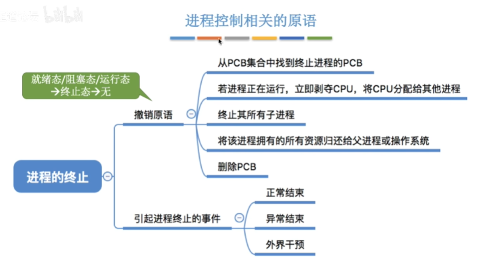
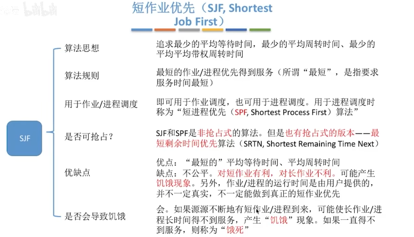
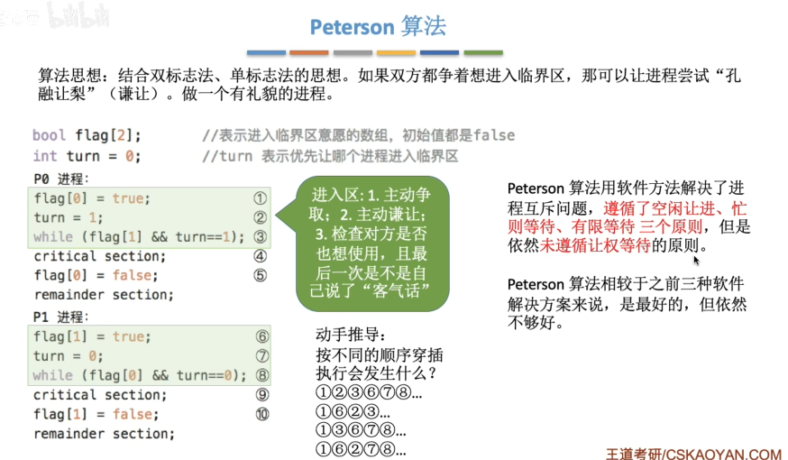
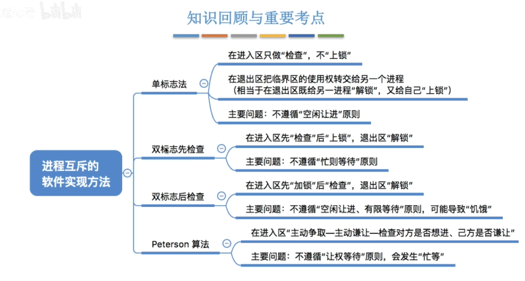
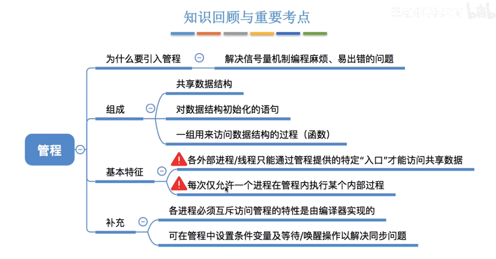
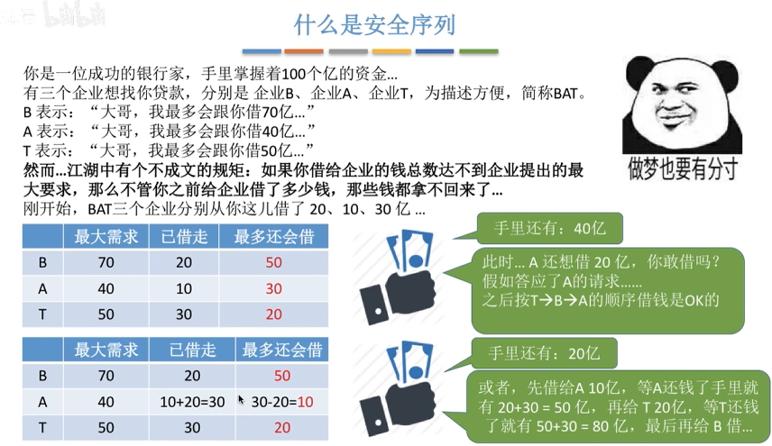
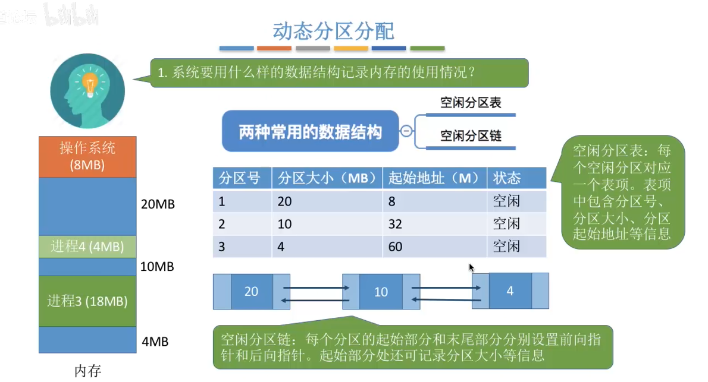

**操作系统**:控制和管理整个计算机系统的软硬件资源,并合理地组织调度计算机的工作和资源的分配,以提供给用户和其他软件方便的接口和环境,它是计算机系统中最基本的系统软件

- 资源管理者
    提供的功能: 
    - 处理机管理
    - 存储器管理
    - 文件管理
    - 设备管理

#### 操作系统的功能和目标 --向上层提供方便易用的服务

直接给用户使用:GUI

软件/程序员使用:
- 联机命令接口:交互式命令接口
- 脱机命令接口:批处理命令接口(脚本)
- 程序接口:系统调用

***
#### 操作系统的四个特征
- 并发:交替进行(宏观上同时进行)
  并行:同时进行
- 共享:
  - 互斥共享:一个时间段内只允许一个进程访问该资源
  - 同时共享: 允许一个时间段内由多个进程"同时"它们进行访问
- 虚拟:
  - 空分复用(如虚拟存储器技术)
  - 时分复用(如虚拟处理器)
- 异步

*并发和共享互为存在条件*
*没有并发性 虚拟性就没有存在的意义*
*只有系统拥有并发性 才有可能导致异步性*

***

#### 操作系统的发展和分类

1.手工操作阶段:人机速度矛盾,资源利用率低
2.批处理阶段:缓解人机速度矛盾

- 单道批处理系统:内存中只有一道程序运行,cpu有大量的空闲时间等待IO完成
- 多道批处理系统:程序无法人机交互
  
3.分时操作系统:计算机以时间片为单位轮流为各个用户/作业服务:不能优先处理紧急的任务
4.实时操作系统:及时可靠
  - 硬实时系统:必须在规定的时间内完成处理  如:导弹控制系统 自动驾驶系统
  - 软实时系统:能接受偶尔违反时间规定 如:订票系统

网络操作系统:windows NT
分布式操作系统
个人计算机系统:MacOS,Windows XP

***

#### 操作系统的运行机制

两类程序:
- 内核程序:特权指令
- 应用程序:非特权指令

对应两种处理器状态:
- 内核态/核心态/管态
- 用户态/目态
  
内核:内核是操作系统最重要最核心的部分 由很多内核程序组成操作系统内核

如何**变态**?
**内核态**->**用户态**:一条修改PSW的特权指令
**用户态**->**内核态**:由中断引起 硬件自动完成

***

#### 中断

**中断**是操作系统==夺回CPU使用权==的唯一途径,使CPU从用户态变为内核态

- 内中断(异常,例外):与当前执行的指令有关,中断信号来自CPU内部
  - 陷阱 陷入(trap)
  - 故障(fault):缺页故障
  - 终止(abort)
- 外中断(中断):与当前执行的指令无关,中断信号来自CPU外部
  - 时钟中断
  - I/O中断请求

**中断机制的基本实现**:
- 检查中断信号:
  - 内中断:CPU在执行指令时会检查是否有异常发生
  - 外中断:每个指令周期末尾,CPU都会检查是否有外中断信号需要处理
- 找到相应的中断处理程序

**中断机制的基本原理**:不同的中断信号,需要用不同的中断处理程序来处理,当CPU检测到中断信号后,会根据中断信号的类型去查询"中断向量表",以此来找到中断处理程序在内存中存放的位置

***

#### 系统调用
应用程序可以通过系统调用来请求获得操作系统内核的服务

**系统调用和库函数的区别**

编程语言:向上提供库函数 有时会将系统调用封装成库函数,以隐藏系统调用的一些细节,使程序员编程更加方便

操作系统:向上提供系统调用,使得上层程序能请求内核的服务

**什么功能要用到系统调用?**

- 设备管理
- 文件管理
- 进程控制
- 进程通信
- 内存管理
  
**系统调用的过程**

==传递系统调用参数->执行陷入指令(用户态)->执行相应的内核程序处理系统调用(核心态)->返回应用程序==

陷入指令是在用户态下执行的,执行陷入指令之后立即引发一个中断,使CPU进入核心态

发出系统调用请求是在用户态,而对系统调用的相应处理是在核心态下进行

***
#### 操作系统的结构

#### 操作系统的内核
- 大内核
  - 将操作系统的主要功能模块都作为系统内核,运行在核心态
  - 缺点:内核代码庞大,结构混乱,难以维护
  - 优点:高性能
- 微内核:只包括时钟管理,中断处理等
  - 只保留最基本的功能在内核
  - 优点:内核功能少,结构清晰,方便维护
  - 缺点:需要频繁变态,性能低

大内核操作系统:Linux,UNIX
微内核操作系统:Windows NT

==简单来说，内核就是为操作系系统提供驱动、内存管理、网络、IO等功能的软件代码==
***

#### 操作系统的引导

***
#### 虚拟机

第一类虚拟机（Type-1 Hypervisor）​不等同于电脑的多系统，它们在架构和工作原理上有本质区别。

**多系统vs第一类虚拟机**

|特性|多系统|第一类虚拟机|
|:-----:|:-----:|:-----:|
|运行层级|​直接运行在物理硬件上|直接运行在物理硬件上|
|并发性|同一时间只能运行一个系统|同时运行多个独立系统|
|资源隔离|无隔离（切换需重启）|	​硬件级隔离（安全且独立）​|
|性能损耗|无额外损耗（直接使用硬件）|	极低损耗（接近原生性能）|
|典型场景|个人电脑安装 Windows+Linux|	企业服务器、云计算平台|
|核心目的|​单机多OS切换|硬件资源最大化利用|
|资源分配|固定分区（安装时划分磁盘|	​动态分配（CPU/内存/存储）​|
|硬件要求|普通PC|	支持 VT-x/AMD-V 的服务器硬件|

***

#### 进程(Process)的概念 组成 特征

**进程的概念**

程序是静态的,就是个存放在磁盘里的可执行文件,就是一系列指令的集合

进程是动态的,是程序的一次执行过程

**进程的组成**:

*操作系统要记录PID,进程所属用户ID(UID)*(基本的进程描述信息,可以让操作系统区分各个进程)

*以及记录给进程分配了哪些资源*(可用于实现操作系统对资源的管理)

*还要记录进程的运行情况*(可用于实现操作系统对进程的控制,调度)

这些信息都被保存在一个数据结构==PCB==中,即==进程控制块==.操作系统需要对各个并发运行的进程进行管理,单反管理时所需要的信息都会放在PCB中

**程序是如何运行的?**

程序段,数据端,PCB三部分组成了进程实体(进程映像)

进程是进程实体的运行过程,是系统进行资源分配和调度的一个独立单位

***PCB是进程存在的唯一标志***

**进程的特征**

***

##### 进程的状态与转换

==运行态可以转换为阻塞态,阻塞态不能直接转换为运行态,先转换为就绪态==

==时间片到,运行态转变为就绪态==

**进程的组织--链接方式**

- 按照进程状态将PCB分为多个队列
- 操作系统持有指向各个队列的指针

**进程的组织--索引方式**

- 根据进程状态的不同,建立几张索引表
- 操作系统持有指向各个索引表的指针

大多数操作系统使用链式方式

***

##### 进程控制

- **什么是进程控制**
  
  进程控制的主要功能是对系统中的所有进程进行有效的管理,它具有创建新进程,撤销已有进程,实现进程状态转换的功能

- **如何实现进程控制**
  

- **如何实现原语的"原子性"**
  
  进程控制的程序-原语是内核程序,运行在内核态

  关中断指令和开中断指令都是特权指令

<u>**进程控制相关的原语**</u>

   - 进程的创建
    
   - 进程的终止
    
   - 进程的阻塞和唤醒
    
    阻塞和唤醒要成对出现
   - 进程的切换
    

进程控制无非要进行三件事情:
1.更新PCB中的信息
2.将PCB插入合适的队列
3.分配/回收资源

==进程的控制的相关疑问==

**控制进程切换的原语是内核程序,是不是意味着实现进程的切换一定会进行CPU的变态,而实现进程的控制不一定要用到内核态?**

​进程切换（Process Switching）必然导致CPU从用户态陷入内核态，因为它完全由内核调度器负责，涉及硬件上下文的直接操作。

而进程控制（Process Control）的核心操作也必须在内核态完成，但用户程序通过系统调用接口来发起这些控制请求，系统调用的使用本身也包含了用户态到内核态的切换。

***

##### 进程通信(IPC)

进程间通信(IPC)是指两个进程之间产生数据交互

为了保证安全,一个进程不能直接访问另一个进程的地址空间

- 共享存储

  - 基于存储区的共享:
    比如共享空间中只能放一个长度为10 的数组.这种共享方式速度慢,限制多,是一种低级通信的方式

  - 基于数据结构的共享:
    操作系统在内存中划分一块共享存储区,数据的形式,存放的位置都由通信进程控制,而不是操作系统.这种共享方式速度快,是一种高级通信方式

增加页表项/段表项[^1]
PV工具[^2]
  

- 消息传递
  
  进程的数据交换以格式化的消息为单位,进程间通过操作系统提供的"发送消息/接收消息"两个原语进行数据交换
  
  - 直接通信
    
  - 间接通信
    
  
- 管道通信
  

***

##### 信号

信号:用于通知某个特定事件已经发生.进程收到一个信号后,对该信号进行处理

**信号的发送与保存**

发送调用系统函数
保存时保存至进程PCB中

**信号的处理**

**什么时候进行处理?**

当进程从内核态转为用户态时(如系统调用返回,中断处理返回等),例行检查是否有待处理的信号.如果有就处理信号

**怎么处理信号?**

**各个进程的信号处理有何区别**

各个进程可以自定义单独的信号处理程序

**信号与异常有什么关系?**

**总结**
 

==进程间为什么要通信?(IPC)==

***

#### 线程(Thread)

有的进程需要你同时作很多事情,传统的进程只能串行地执行一系列程序.引入线程来增加并发度

线程成为程序执行流的最小单位

==进程是资源分配的最小单位,线程是调度的基本单位==

***

##### 线程的实现方式

- **用户级线程**

  早期的这种线程是并行的(交替进行),一个线程被阻塞就会中断进程的完成

- **内核级线程**
  

<u>注意:内核级线程的管理工作在操作系统内核完成,并不代表进程和线程是一直在核心态的,进程的运行状态不是固定的，它会在用户态和内核态之间动态切换。绝大多数时间，进程都运行在用户态；当需要操作系统提供服务时，它会通过系统调用等方式进入内核态。</u>

线程的切换是操作系统完成的,所以需要切换到核心态

- **多线程模型**

***

##### 线程的状态与转换

***

####  处理机调度的概念 层次

- 调度的基本概念
  
  按照某种规则来决定任务处理的顺序
  
  **调度的三个层次**

  - 高级调度(作业调度)

    <u>按一定的原则从外存的作业后备队列中挑选一个作业调入内存,并创建进程.每个作业只调入一次,调出一次.作业调入时会建立PCB,调出时才会撤销PCB</u>

   - 低级调度(进程调度/处理机调度)
     
     <u>按照某种策略从就绪队列中选取一个进程,将处理机分配给它</u>

     进程调度是操作系统中最基本的一种调度,在一般的操作系统中都必须配置进程调度.进程调度的频率很高,一般几十毫秒一次

   - 中级调度(内存调度)

     <u>按照某种策略将哪个处于挂起状态的进程重新调入内存.一个进程可能会被多次调出,调入内存,因此中级调度发生的频率要比高级调度更高</u>

     内存不够时,可将某些进程的数据调入外存.等内存空闲或者进程需要运行时重新调入内存

     暂停调到外存等待的进程状态称为挂起状态,被挂起的进程PCB会被组织成挂起队列

==都是将进程调入内存,高级调度的频率比中级调度低是因为高级调度调入进程时需要创建PCB吗?==
注:这里表述有问题

​高级调度（低频）​​：它负责将一个全新的作业从外存（如硬盘）调入内存，并为其创建进程控制块（PCB）​​ 和分配资源，使其成为一个可以参与CPU竞争的进程。这个过程开销较大，且作业的生命周期相对较长（比如一个编译任务或计算任务从开始到结束），因此无需频繁进行

​中级调度（中频）​​：它的目的是提高内存利用率和系统吞吐量​当系统内存紧张时，中级调度会将内存中暂时不运行的进程​（其PCB已存在）​挂起并换出到外存；当内存有空闲或有需要时，再将外存中符合条件的进程​（其PCB已存在）重新换入内存。一个进程在其生命周期内可能会被多次换出和换入（例如，一个后台进程可能因前台应用活跃而被换出，又因用户切换回来而被换入），因此中级调度发生的频率自然比高级调度高得多

**状态的补充:**

就绪挂起引发的原因几乎全是内存空间不足

阻塞挂起的原因内存空间不足,预计等待时间较长等

**三层调度的联系&对此**

***

##### 进程调度的时机,切换与过程的调度方式

- 进程调度的时机

有的系统中只允许进程主动放弃处理机

有的系统中中进程可以主动放弃处理机,当有更紧急的任务需要处理时,也会强行剥夺处理机(被动放弃)

- 进程调度的方式

- 进程的切换与过程

进程的调度和切换是有代价的,不是越频繁越好

***

##### 调度器和闲逛进程

- 调度器/调度程序

  

非抢占式调度策略只允许进程主动放弃处理机
运行进程阻塞或退出时程序主动放弃处理机

但创建新进程和并没涉及放弃处理机

抢占式当就绪队列发生变化的时候都要检查是不是有优先级更高的竟成了需要处理机处理

调度:分配处理机

- 闲逛进程(idle)

***

##### 调度算法的评价指标

1.CPU利用率
2.系统吞吐量:单位时间内完成作业的数量
3.周转时间:

4.等待时间:

5.响应时间:指从用户提交请求到首次产生响应的时间
 对于计算机用户来说,会希望自己提交的请求(比如键盘输入的一个调试命令)尽早地被系统服务,回应

 ***

##### 调度算法

- 先来先服务(FCFS first come first service)

  
  
  
- 短作业优先(SJF shortest job first)

  - 非抢占式
  

  - 抢占式(SRNT最短剩余时间优先)
  

  

- 高响应比优先(HRRN highest responese ratio next)

  

**知识回顾与重要考点**

- 时间片轮转(RR Round-Robin)
  
  ==用于进程调度,常用于分时操作系统,更注重响应时间==
  时间片过大会退化成先来先服务(FCFS),并且会增大进程响应时间

  

  

- 优先级调度
  - 非抢占式
  - 抢占式
  

  

  补充:
  
  动态优先级,be similar with 高响应比优先算法

问:我无法理解I/O型进程的优先级高于CPU繁忙型进程,让CPU繁忙型进程优先级更高不是能让CPU完成更多的工作,CPU充分得到利用吗?

  

给I/O型进程更高优先级，是为了“哄着”它赶紧把自己的慢活（I/O操作）交代给外部设备，好把快速的CPU资源尽快让出来给其他进程使用。​​ 这是一种“以空间换时间”的策略，通过牺牲一点点CPU可能的闲置时间，换来了整个系统硬件资源（CPU+I/O）更高程度的并行度和更快的整体任务完成速度，同时保证了面对用户的及时响应。

- 多级反馈队列调度算法

  eg:

  

==上三个算法的总结对比:==

- 多级队列调度算法

  

***

##### 多处理机调度

多处理机:多核CPU

多处理机调度:1.考虑让哪个就绪进程优先上处理机 2.还需要考虑上哪个处理机运行

负载均衡:尽可能让每个CPU同等忙碌

处理机亲和性:尽量让一个进程调度到同一个CPU上运行,以发挥CPU中缓存的作用

解决方法:

- 公共就绪队列

- 私有就绪队列

  

  <u>目标一:如何实现CPU的负载均衡</u>

  - 推迁移策略:
    
    一个特定的系统程序周期性地检查每个处理器地负载,如果负载不均衡,就从忙碌CPU的就绪队列中"推"一些就绪进程到空闲CPU的就绪队列

    推迁移相当于一个包工头专门负责派活

  - 拉迁移策略:

    每个CPU运行调度程序时,周期性地检查自身负载与其他CPU负载.如果一个CPU负载很低,就从其他高负载的CPU就绪队列中"拉"一些就绪进程到自己的就绪队列中
  
  <u>目标二:私有就绪队列天然地实现了"处理机亲和性"</u>
    
    

***

#### 同步,互斥的基本概念

**什么是进程同步?**

进程具有异步性特征.异步是指各并发执行的进程以各自独立的,不可预知的速度向前推进

同步亦称直接制约关系,它是指为完成某种任务而建立的两个或多个进程,这些进程需要在某些位置上协调它们的工作次序而产生的制约关系.进程间的直接制约关系就是源于它们之间的相互合作

**什么是进程互斥?**

==违反了空闲让进的原则==

为了实现对临界资源的互斥访问,同时保证系统的整体性能,需要遵循以下原则:

***

##### 进程互斥的软件实现方法

- 单标志法

==违反了空闲让进的原则==

- 双标志先检查法

==违反了忙则等待原则==   
   
- 双标志后检查法

- Peterson算法

上述的算法都要在时间片上不断判断自己是否能否进入临界区,违反了让权等待的原则

***
##### 进程互斥的硬件实现方法

- 中断实现方法

- TestAndSet指令

- Swap指令

***

##### 进程互斥:锁

***

##### 信号量机制

- 整型信号量

信号量代表了系统的某种硬件资源,不能当普通变量使用

不符合让权等待的原则

- 记录型信号量

 
举例:
 

 

 

 若考试中出现P(S),V(S),除非特别说明,否则默认S为记录型信号量

 ***

 ##### 用信号量是实现进程互斥,同步,前驱关系

- 进程互斥

- 进程同步

- 实现进程的前驱关系

***

##### 生产者,消费者问题

缓冲区是临界资源,必须互斥访问

把使用产品的代码放在临界区中在逻辑上是没有错误的,但是会延长临界区资源的代码,占用更长时间的临界区资源   

***
##### 多生产者多消费者问题

生产和消费的东西是'多种类'

- 重要考点
  容量为2可能引起资源争夺

***
##### 读者,写者问题

==解决写进程饥饿的问题==

当写进程进行时,会堵塞后续的读进程,下一次将优先进行写进程

V(rw)最后一个读进程释放锁,使下一次运行的权力给予写进程

==知识总结==

***
##### 哲学家进餐问题

阻止死锁发生的第三个方法

  

分情况说明:
1. 0号拿两个过程中锁没释放,别人都拿不了
2. 0号拿了两个,一号上锁被堵塞,2号也拿不了筷子
情况2只能等待资源的释放才能进行下去

***
#### 管程

互斥和同步包装了一下，要用到的时候就调用

***
#### 死锁

==互斥、不剥夺、请求与保持、循环等待==

总结:

***
##### 死锁的处理策略--预防死锁

- 破坏互斥条件

- 破坏不剥夺条件

- 破坏请求和保持条件

- 破坏循环等待条件

***
##### 死锁的处理策略--避免死锁

- 利用安全序列实现银行家算法

**代码实现思路**

总结:

***
##### 死锁的处理策略--死锁的检测和解除

- 死锁的检测

总结:

***
#### 内存

##### 内存的基础知识
- 什么是内存?

- 三种链接方式

- 三种装入方式

适用于单道程序环境
  

适用于多道批处理操作系统

- 总结

***
##### 内存管理的基本概念

***

##### 进程的内存映像

***

##### 内存空间的扩充

- 覆盖技术

- 交换技术

总结:

***

##### 内存空间的分配与回收    

###### 连续分配管理方式

- 单一连续分配

- 固定分区分配

==内外部碎片==

- 动态分区分配

  - 常用的两种数据结构
  

  - 选择分配区
  

  动态分区匹配算法:
  - 首次适应算法:
  

  - 最佳适应算法:
  

  - 最坏适应算法:
  

  - 临近适应算法:
  

  分区分配算法的总结:
  

  - 分区的分配与回收

    1. 分配时:
  
    
    分区数不变,直接改变空闲分区的分区大小和起始地址

    
    占完了一个分区直接删除表中的记录,或者链表中的一个节点   

    2. 回收时:
    
    
    <u>区分回收的空闲分区在当前空闲分区的前面还是后面</u>

总结:

***

###### 非连续分配管理方式
***

- 基本分页存储管理:

==页内偏移量和块内偏移量一致==

==除法运算相当于算数右移,取模运算相当于按位与==

总结:

- 基本地址分页变换机构
  

   

 

总结:

***
- 具有快表的地址变换机构

总结:

***

- 两级页表

总结:

***

- 基本分段存储管理

***

- 分段和分页的区别:

总结:

***

