**数据库(DB)**:存放数据的仓库,数据是有组织的进行存储
**数据库管理系统(DBMS)**:操纵和管理数据库的大型软件
**SQL**:操作关系型数据库的编程语言,定义了一套操作关系型数据库的统一标准

**mysql数据库的启动**:
- 数据库启动:win+R sevices.msc
- MySQL**数据库的启动**:net start mysql80   
**停止**:net stop mysql80

**mysql客户端连接**(mysql与本机的连接):
- **在mysql的命令行客户端内**输入密码连接
- **在系统自带的命令行工具中**mysql -u root -p

-h 指明服务端程序在哪个地址上
输入命令的命令行所在的主机是客户端

**关系型数据库(RDBMS)**:
1.使用表结构存储数据,格式统一,便于维护
2.使用SQL语言操作,标准统一,使用方便

**MySQL数据模型**:
- 数据库
- 表

***

**SQL通用语法**:

跟python相似的单行注释:

--或#

/*
多行注释
*/

***

### DDL数据库定义


#### DDL-数据库操作

- 查询

  - *查询所有数据库*
  ```
  show databases;
  ```
  - *查询当前数据库*
  ```
  select database();
  ```
- 创建数据库
  ```
  create database[if not exists] 数据库名称 [charset UTF-8] [collate 排序规则];
  ```

在数据库中某些数据是四个字节,而UTF8只有三个字节,一般使用UTF8mb4

- 删除数据库
  ```
    drop database [if exists] 数据库名称;
  ```
- 使用数据库
  ```
    use 数据库名称;
  ```
***

#### DDL-表操作

- 查询
  - 查看数据库的所有表
  ```
    show tables
  ```
  - 查询表结构
  ```
    DESC 表名;
  ```
  - 查询指定表的建表语句
  ```
    show create table 表名
  ```
- 创建
   ```
     create table 表名称(
     列名称 列类型[comment 字段1注释],
     列名称 列类型[commment 字段2注释],
     ......
  )[comment 表注释];
   ```


  *上述知识的具体例子*:eg:
  ```
  create table emp(
     id int,
     workno varchar(10) comment '工号',
     name varchar(10) comment '姓名',
     gender char(1) comment '性别',
     age tinyint unsigned comment '年龄',
     idcard char(18) comment '身份证号',
     entrydate date comment '入职时间'
  ) comment '员工表';
  ```
- 修改

  - 添加字段
  ```
    alter table 表名 add 字段名 类型(长度) [comment 注释] [约束];
  ```
  - 修改数据类型
  ```
    alter table 表名 modify 字段名 新数据类型(长度);
  ```
  - 修改字段名和字段类型
  ```
    alter table 表名 change 旧字段名 新字段名 类型(长度) [comment 注释] [约束];

    eg:alter table emp change nickname username varchar(30) comment '用户名';
  ```
  - 删除字段
  ```
    alter table 表名 drop 字段名;
  ```
  - 修改表名
  ```
    alter table 表名 rename to 新表名;
  ```
- 删除
  ```
   drop table [if exists] 表名称
   truncate table 表名   (删除表并重新创建该表,即清空表)
  ```

**列类型**:

- **数值类型**:

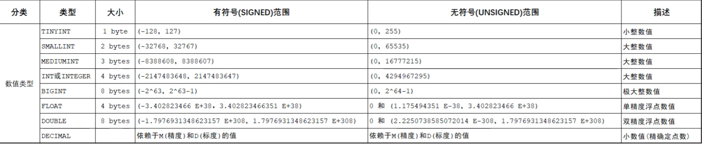

- **字符串类型**

*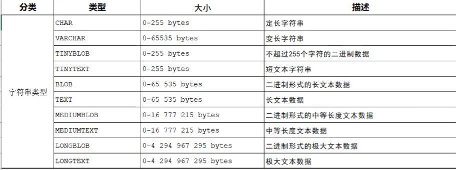
char(10)性能好
varchar(10)根据字符长度分配空间资源,性能差但空间利用率高*

*长度确定时使用char以获得更高的性能
长度不确定的时用varchar*

- **日期类型**

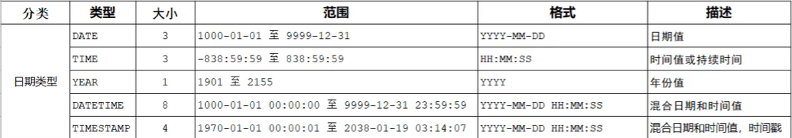

  *数据库中的时间戳是用于记录数据的时间信息的一种数据类型，可以用于追踪数据的创建和修改时间、实现数据的版本控制和一致性验证、进行数据的同步和复制，以及进行数据分析和报告等。时间戳在数据库管理和应用开发中具有重要的作用。*

***

### DML数据库操作

DML:数据操作语言,Data Mainpulation Language,用来对数据库中表的数据记录进行更新

- DML-添加数据

  - 给指定字段添加数据
  ```
    insert into 表名(字段1,字段2,...) values(值1,值2,...);
  ```
  - 给全部的字段添加数据
  ```
    insert into 表名 values(值1,值2,...);
  ```
  - 批量添加数据
  ```
    insert into 表名(字段1,字段2,...) values(值1,值2,...),(值1,值2,...),(值1,值2,...);

    insert into 表名 (值1,值2,...),(值1,值2,...),(值1,值2,...);
  ```
- DML修改数据

  - update 
  ```
    update 表名 set 字段名1=值1,字段名2=值2 [where 条件判断];
  ```

    *利用判断来选择修改的地方没有条件判断说明修改的是整张表*
  ```
  eg:update employee set name = 'wkx' where id=1;
  ```

- DML删除数据
  ```
  - delete from 表名称 [where 条件判断]
  ```
  运算符  = < > <= >= !=
  ```
  eg:delete from employee where gender='女';
  ```
***

### DQL数据查询语言

SELECT
  
  - 基本查询
  查询多个字段

  ```
  基础查询:select 字段列表|* from 表;
  去除重复记录:select distinct 字段列表 from 表名
  ```
***
  - 条件查询
  ```
   select 字段列表 from 表名 where 条件列表;
  ```
   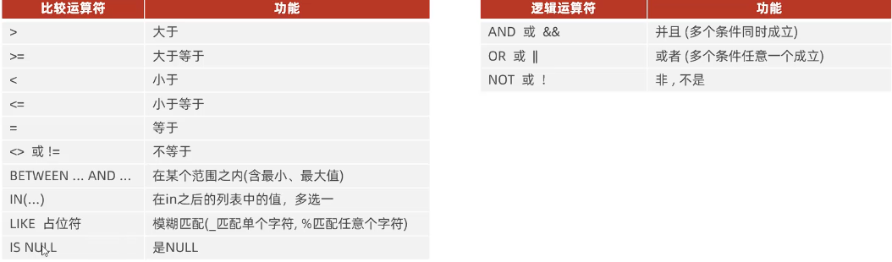

  - 聚合函数
  ```
    select 聚合函数(字段列表) from 表名;
  ```
   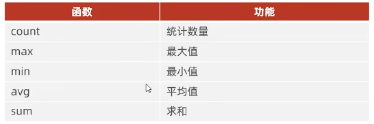
***
  - 分组查询
    
    ```
    select 字段列表 from 表名 [where 条件] group by 分组字段名 [having 分组过滤后的条件];
    ```
   
    - 基本查询:
    ```
    select gender,count(*) from emp group by gender
    ```
    - 分组查询:
  
      *查询年龄小于45的员工,并根据工作地址进行分组,获取员工数量大于等于3的工作地址*
    ```
      select address,count(*) address_count ==别名== where age<45 group by address having count(*)>=3;
    ```

    ==where与having区别:==

    1. 执行时机不同:where是分组之前进行过滤,不满足where条件不参与分组,而having是分组之后对结果进行过滤

    2. 判断条件不同:where不能对聚合函数进行判断,而having可以  

***
  - 排序查询
    ```
    select 字段列表 from 表名 order by 字段一 排序方式一,字段二 排序方式二
    ```
    多字段排序:当第一个字段相同时,才会根据第二个字段进行排序

    ```
    eg:
    select * from emp order by age asc;

    select * from emp order by age desc;
    ```

    根据年龄对公司的员工进行升序排序,,年龄相同,再按照入职时间进行降序排序
  
    ```
    select * from emp order by age asc,entrydate desc;

    asc可以省略,默认
    ```

  - 分页查询
    ```
    select 字段列表 from 表名 limit 起始索引,查询记录数;

    eg:
    select * from emp limit 0,10;
    ```

==注意:==
  1.起始索引从0开始,起始索引=(查询页码-1)*每页记录数
  2.分页查询是数据库的方言,不同的数据库有不同的实现
  3.查询的是第一页的数据,起始索引可以省略,直接简写未limit 10

  排列顺序:

  ```
    select * from emp where gender='男' and age between 20 and 40 order by age asc,entrydate desc limit 5;
  ```

**DQL语句的执行顺序**

  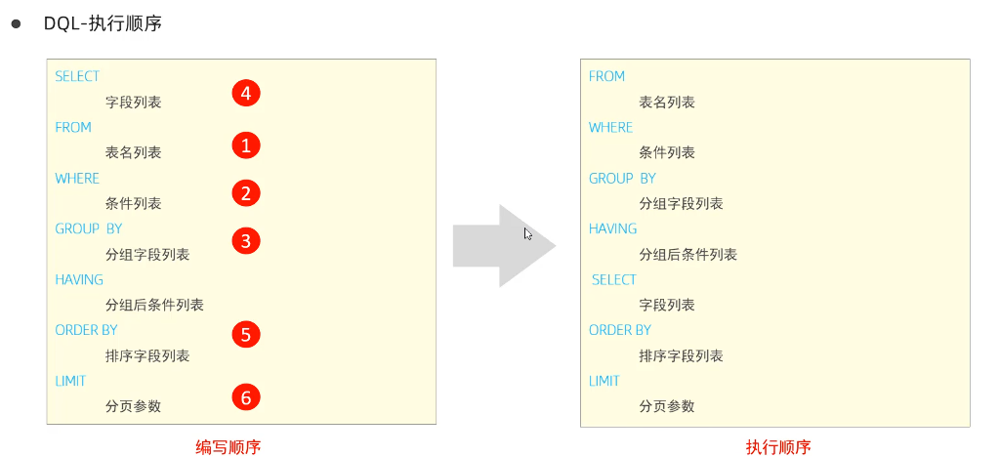

***

### DCL数据控制语言

DCL(Data Control Language),用来管理数据库用户,控制数据访问权限

- 用户管理
  
  **1.查询用户**
  ```
    - use mysql;
    - select * from user;
  ```
    
  **2.创建用户**
  ```
    - create user '用户名'@'主机名' identified by '密码';
  ```

  **3.修改用户密码**  
  ```
    - alter user '用户名'@'主机名' identified with mysql_native_password by '新密码'  
  ```

  **4.删除用户**
  ```
  - drop user '用户名'@'主机名';  
  ```
   
- 权限控制 
  
  **1.查询权限**
  ```
    - show grants for '用户名'@'主机名';
  ```

  **2.授予权限**
  ```
    - grant 权限列表 on 数据库名.表名 to '用户名'@'主机名';
  ```
  
  **3.撤销权限**
  ```
    - revoke 权限列表 on 数据库名.表名 from '用户名'@'主机名';
  ```
  
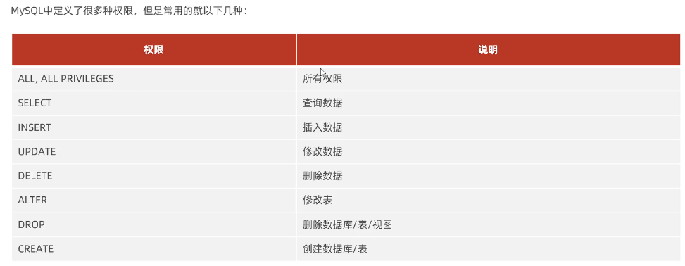

***

### 函数

函数是指一段可以直接被另一段程序调用的程序或代码

- 字符串函数
  
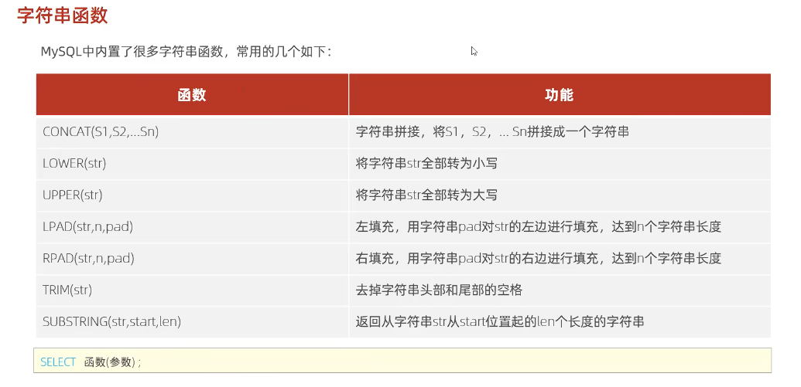

- 数值函数

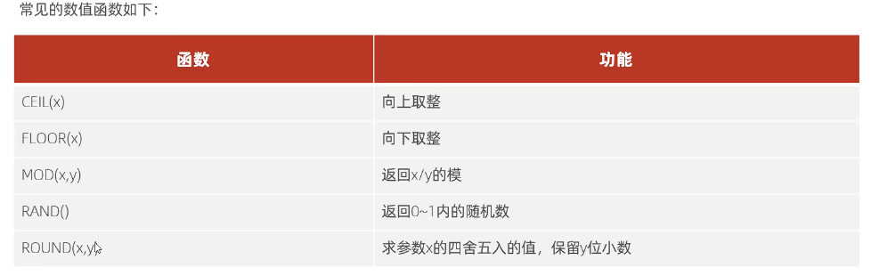

- 日期函数

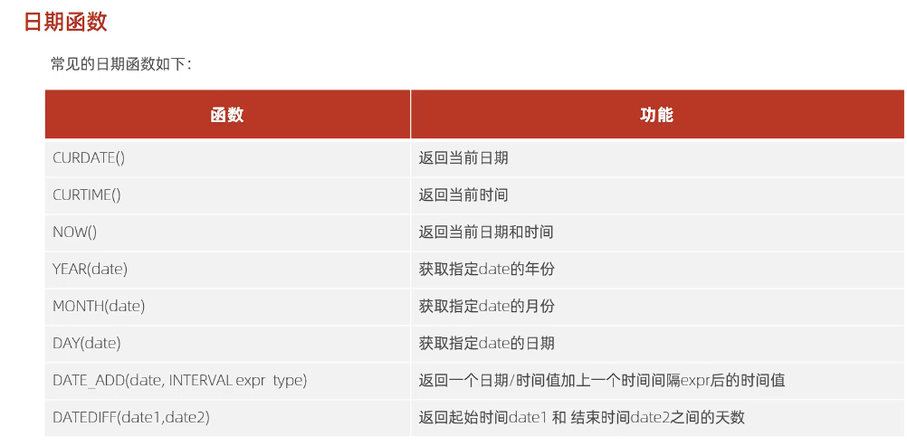

==interval:空间,间隔==

- 流程控制函数

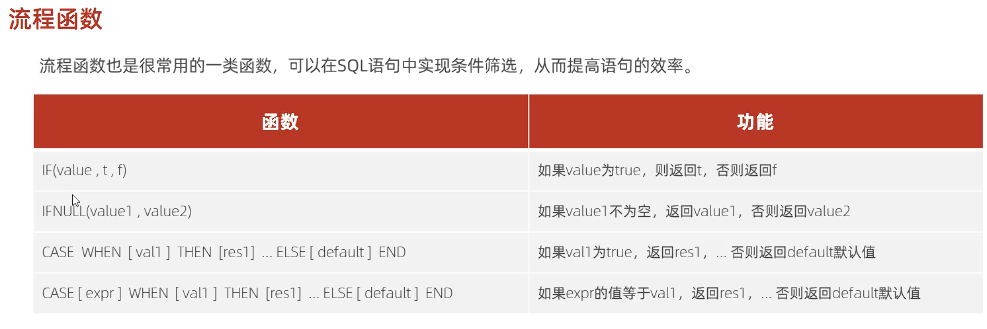

***

### 约束

概念:约束是作用于表中字段上的规则,用于限制存储在表中的数据

目的:保证数据库中数据的正确性,有效性和完整性

分类:
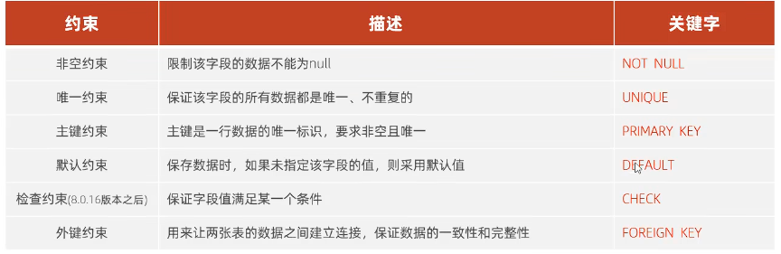

- 外键约束

外键用来让两张表的数据建立连接,从而保证数据的一致性和完整性

添加外键:
```
create table 表名(
  字段名 数据类型,
  ...
  [constraint] [外键名称] foreign key (外键字段名) references 主表(主表列名);
)
```

```
alter table 表名 add constraint 外键名称 foreign key(外键字段名) references 主表(主表列名);
```

删除外键:
```
alter table 表名 drop foreign key 外键名称
```
==constraint 限制,约束==

- 外键删除更新行为

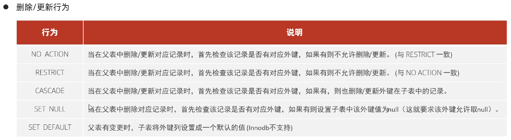

```
alter table 表名 add constraint 外键名称 foreign key (外键字段) references 主表名 (主表字段名) on update cascade on delete cascade;
```

***

### 多表查询

#### 多表关系介绍

概述:项目开发中,在进行数据库结构设计时,会根据业务需求以及业务模块之间的关系,分析并设计表结构,由于业务之间相互关联,所以各个表结构之间也存在各种联系,基本上分为三种:

- 一对多:员工和部门之间的关系
- 多对多:学生和课程之间的关系   建立中间表来关联两个表的主键
- 一对一:用户与用户详情的关系   在任意一方加入主键,并且设置为unique


多表查询的分类:

连接查询:

内连接:相当于查询A,B交集部分的数据

外连接:
  - 左外连接:查询左表所有数据,以及两张表交集部分数据
  - 右外连接:查询右表所有数据,以及两张表交集部分数据

自连接:当前表与自身的连接查询,自连接必须使用表别名

子查询

***

#### 连接查询-内连接

- 隐式内连接

```
  select 字段列表 from 表1,表2 where 条件...;

  select emp.name,dept.name from emp,dept where emp.dept_id=dept.id;
```

- 显式内连接

```
  select 字段列表 from 表1 [inner] join 表2 on 连接条件...;

  select e.name,d.name from emp e inner join dept d on e.dept_id = d.id;
```
  内连接查询的是两张表交集的部分

***

#### 外连接

- 左外连接

```
select 字段列表 from 表1 left [outer] join 表2 on 条件...;

select e.name,d.name from emp e left outer join dept d on e.dept_id=d.id;
```

- 右外连接

```
select 字段列表 from 表1 right [outer] join 表2 on 条件...;

select d.*,e.* from emp e right outer join dept d on e.dept_id = d.id;
```

***

#### 自连接

```
select 字段列表 from 表A 别名A join 表A 别名 B on 条件...;

select a.name,b.name from emp a,emp b where a.managerid=b.id;

select a.name '员工',b.name '领导' from emp a left join emp b on a.managerid=b.id;

select * from emp where age>50
union # [all]
select * from emp where salary<10000;
```

***

#### 联合查询

对于union查询,就是把多次查询的结果合并起来,形成一个新的查询结果集

```
select 字段列表 from 表A ...
union [all]
select 字段列表 from 表B ...;
```
字段数相同,字段类型要一致

***

#### 子查询

概念:SQL语句中嵌套select语句,称为嵌套查询,又称子查询

```
select * from t1 where column=(select column from t2);
```

根据子查询的结果不同,分为:
- 标量子查询(子查询结果为单个值)
- 列子查询(子查询结果为一列)
- 行子查询(子查询结果为一行)
- 表子查询(子查询结果为多行多列)

根据子查询位置分为:
- where之后
- from之后
- select之后


##### 标量子查询
```
-- 查询销售部的id
-- 查询销售部的所有员工信息
select id from dept where name='销售部';
select * from emp where dept_id=4;

select * from emp where dept_id=(select id from dept where name='销售部');

-- 查询在方东白之后入职的员工信息
-- 查询方东白的入职日期
select entrydate from emp where name='方东白';
select * from emp where entrydate>'2006-08-01';

select * from emp where entrydate>(select entrydate from emp where name='方东白');
```

##### 列子查询

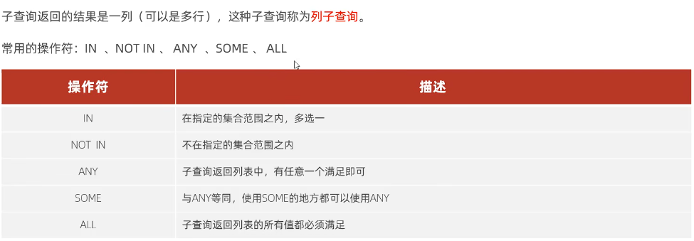
```
select * from emp where dept_id in (select id from dept where name='研发部' or name ='市场部');

select salary from emp where dept_id =(select id from dept where name='研发部');

select name,salary from emp where salary > all (select salary from emp where dept_id =(select id from dept where name='研发部'));
```

#### 行子查询


```
-- 查询金庸,小昭的职位薪资
select job,salary from emp where name='金庸' or name ='小昭';
-- 查询与金庸,小昭的职位,薪资相同的员工信息
select * from emp where (job,salary) in (select job,salary from emp where name='金庸' or name ='小昭');
```

#### 表子查询
```
select * from emp where (job,salary) in (select job,salary from emp where name='金庸' or name ='小昭');

-- 查询入职日期是'2006-01-01'之后的员工信息,及其部门信息
select * from emp where entrydate > '2006-01-01';

-- 查找这部分员工的部门信息;
select e.*,d.* from (select * from emp where entrydate > '2006-01-01') e left join dept d on e.dept_id=d.id;
```

***

### 事务的简介

事务是一组操作的集合,它是一个不可分割的工资单位,事务会把所有的操作作为一个整体一起向系统提交或撤销操作请求,即这些操作要么成功,要么同时失败.

*默认Mysql的事务是自动提交的,也就是说,当执行了一条DML语句,Mysql会立即隐式提交事务*

想要同时完成多个操作,需要手动的开启,提交事务.遇到异常,手动回滚事务

- 查看/设置事务提交方式
```
  select @@autocommit;
  set @@autocommit=0;
```
- 提交事务
```
  commit;
```
- 回滚事务
```
  rollback;
```

方式二:
- 开启事务
```
start transaction或begin
```
- 提交事务
```
commit
```
- 回滚事务
```
rollback
```

***
#### 事务的四大特性

- 原子性:事务是操作的最小的单元,要么全部成功,要么求安不失败
- 一致性:事务完成时必须使所有的数据保持一致状态
- 隔离性:数据库系统提供隔离机制,保证事务在不受外部并发操作影响的独立环境下运行
- 持久性:事务一旦提交或回滚,它对数据库中的数据的改变是永久的

***
#### 并发事务问题
- 脏读:一个事务读到另一个事务还没有提交的数据
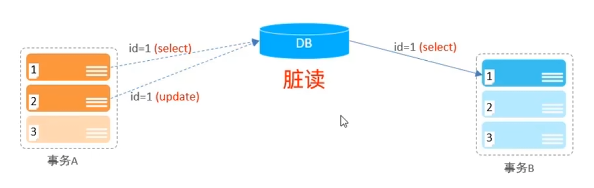
ps:读到了旧数据?
- 不可重复读:一个事务先后读取同一条记录,但两次读取的数据不同,称之为不可重复读
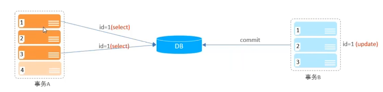
ps:前后读到了更新前后的同一位置的数据
- 幻读:一个事务按照条件查询数据时,没有对应的数据行,但是在插入数据时,又发现这行数据已经存在,好像出现了"幻影"
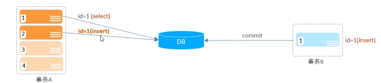

***

#### 事务隔离级别

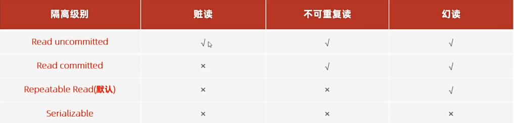

- 查看事务的隔离级别
select @@TRANSACTION_ISOLATION

- 设置事务的隔离级别
set [session|global] transaction isolation level {read uncommitted|read committed|repeatable read|serializable}

==事务隔离级别越高,数据越安全,但是性能越低==

***

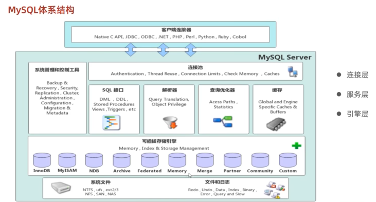

***

### 存储引擎

####  存储引擎简介:

存储引擎是存储数据,建立索引,更新/查询数据等技术的实现方式.存储引擎是基于表的,不是基于库的,所以存储引擎也可以被称为表类型

建表的默认引擎是InnoDB

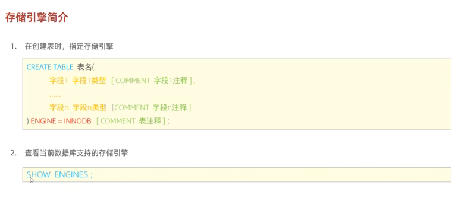

***

#### 存储引擎的特点:
InnoDB:
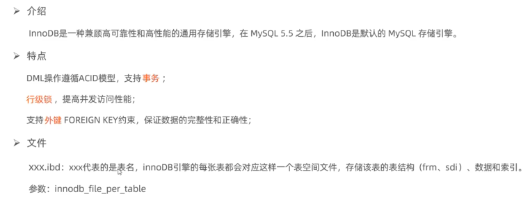

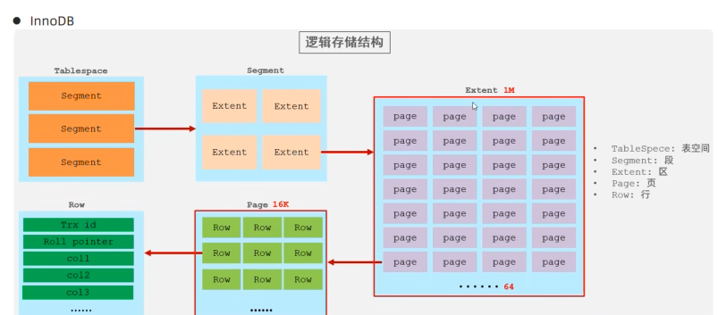


MyISAM

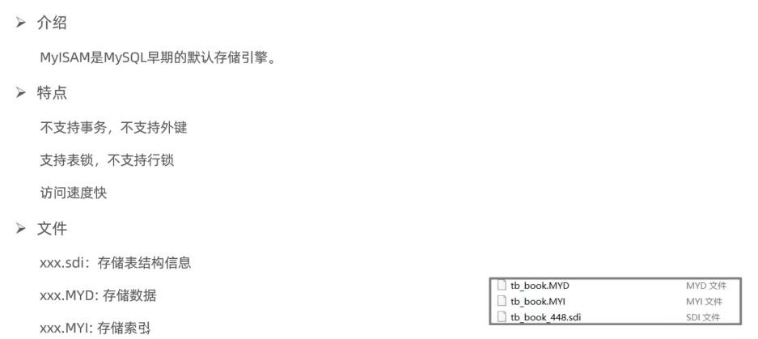


Memory:
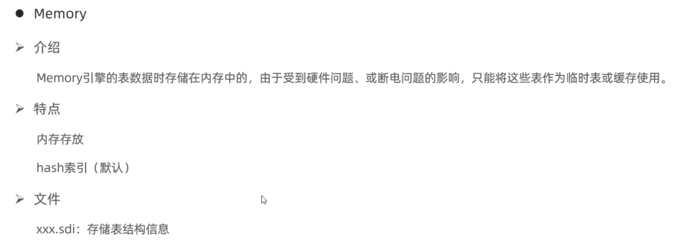
只有一个sdi文件是因为数据和索引都在内存当中

总结:
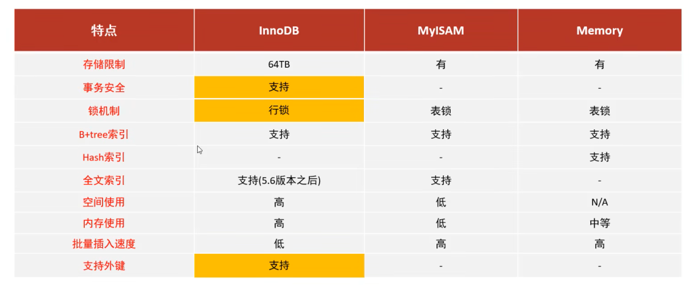

InnoDB和MyISAM的区别:
InnoDB支持事务行级锁,事务,外键,而MISAM只支持表锁

Memory也支持表锁,还支持Hash索引

***

#### 存储引擎选择:
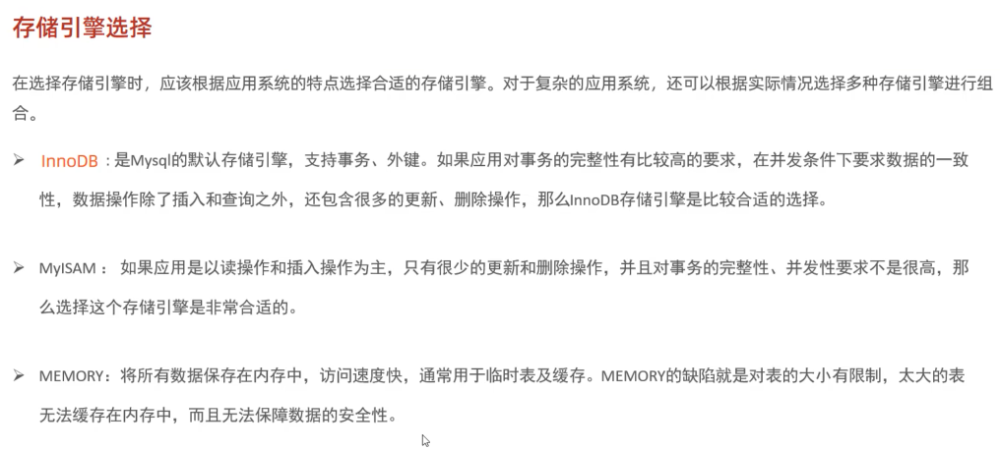

当前MyISAM存储引擎被MongoDB代替,Memory被redis存储引擎代替

***
**虚拟机上的Linux**

sudo mysql 以管理员的权限在Linux终端打开MySQL

'root'@'%' wkxssg688 (%代表在所有主机上都能访问)

***

### 索引

介绍:

索引是帮助MySQL高效获取数据数据结构(有序)>在数据之外,数据库系统还维护着满足特定查找算法的数据结构,这些数据结构以某种方式引用(指向)数据,这样就可以在这些数据结构上实现高级查找算法,这种数据结构就是索引


***
#### 索引的结构

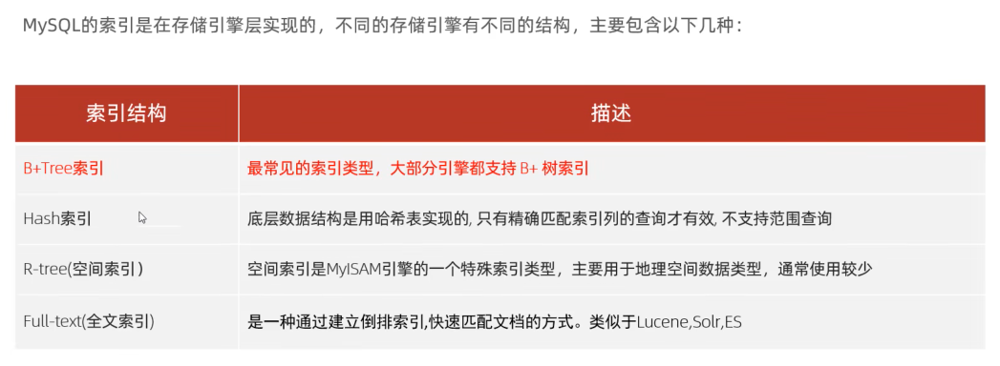

平常所说的索引,没有特别的说明就是B+树索引

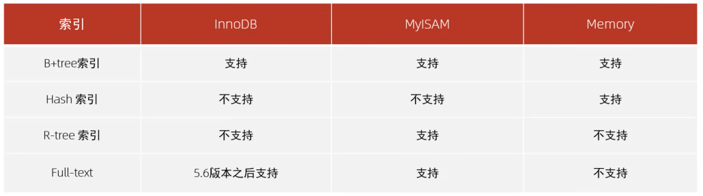

 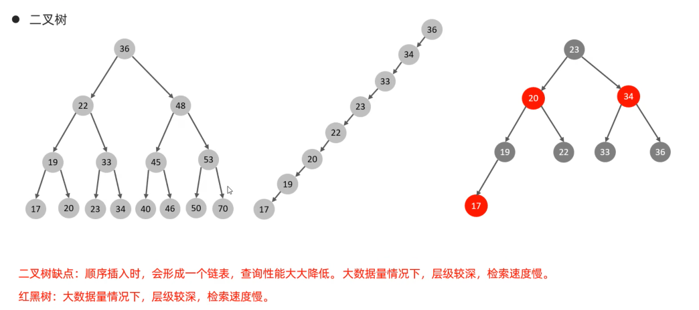

 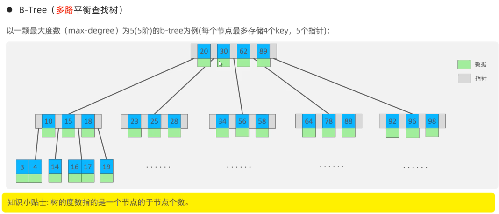

 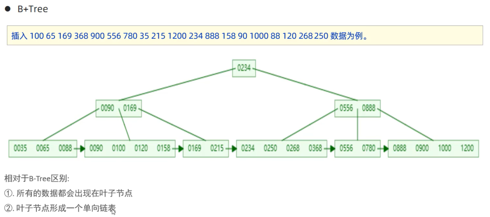

 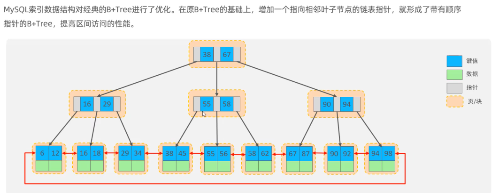

 每一个节点存放在一个页中
 InnoDB存储引擎存储结构:表空间,段去,区,页
 每个页的大小是16kB

 [数据可视化网站](https://www.cs.usfca.edu/~galles/visualization/Algorithms.html)

 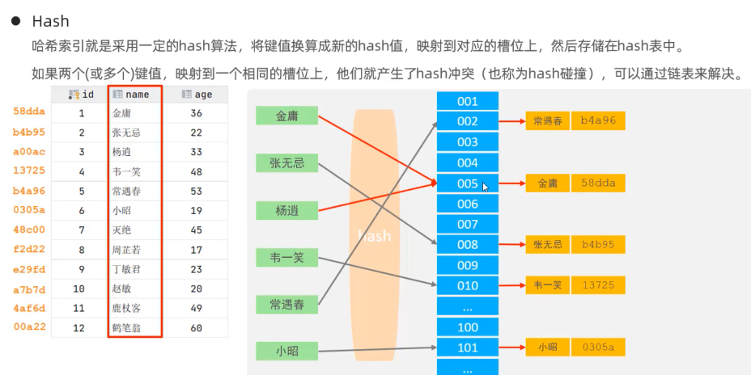
 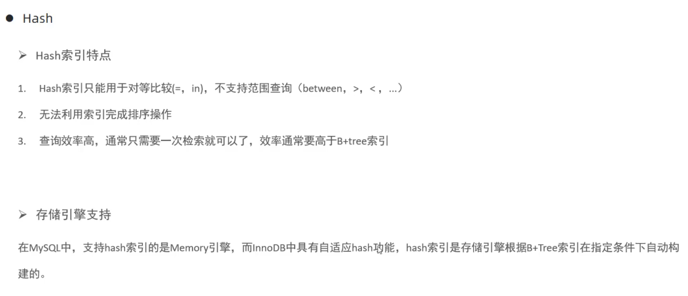


 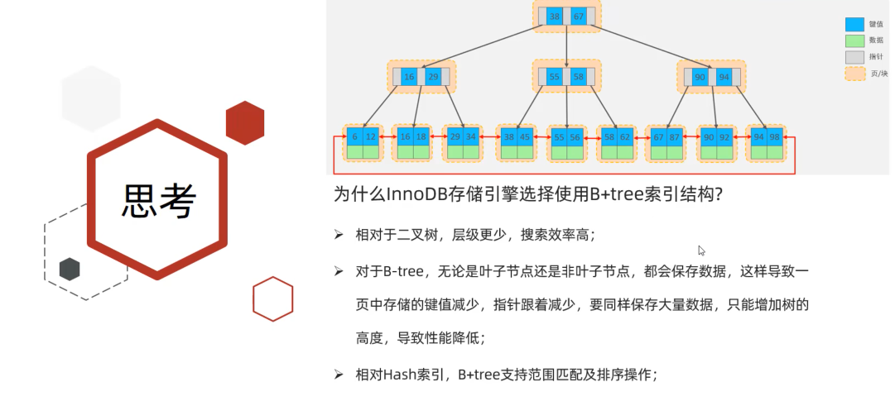

在叶子节点形成双向链表,便于范围搜索和排序
查找的数据在叶子节点都能找到,搜索效率稳定
 ***

#### 索引分类

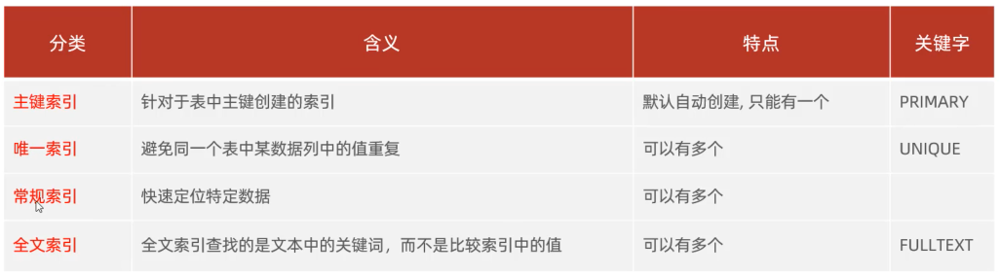

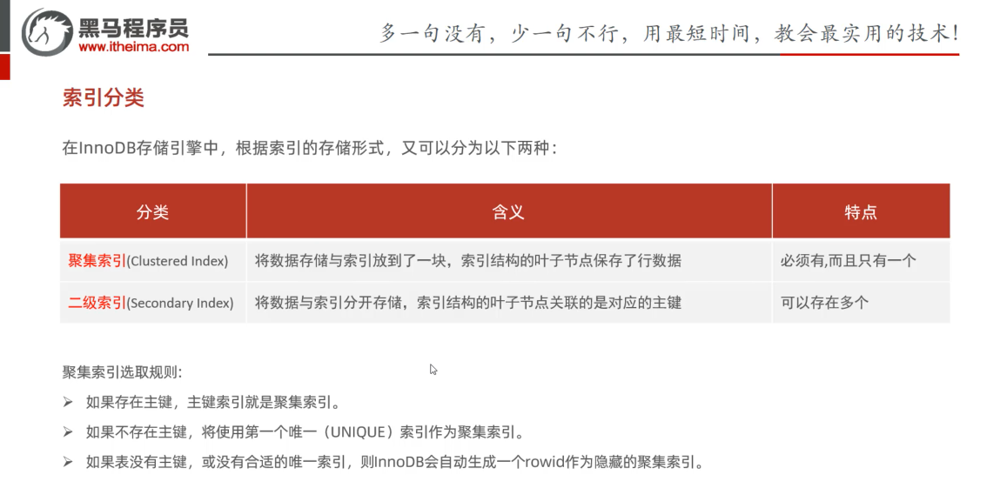

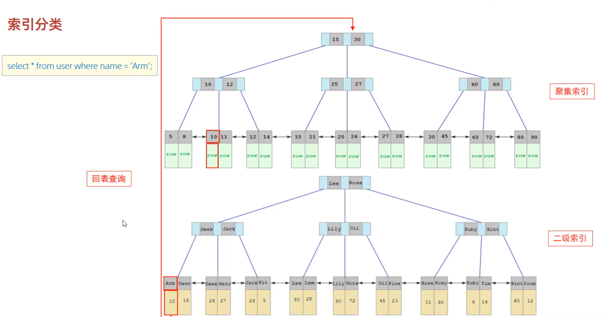

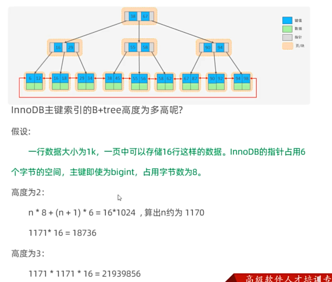

***

