## 数据结构

---
### 第一章 数据结构

#### 数据结构基本概念

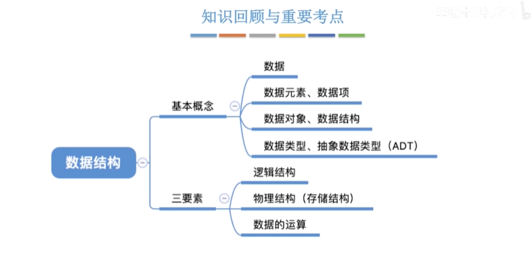

---
#### 数据结构的三要素

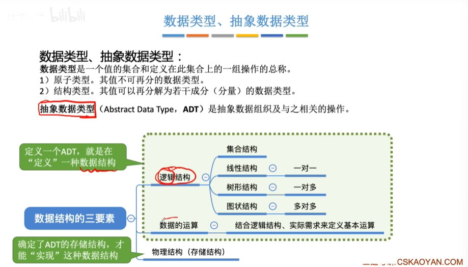

---
#### 算法的基本概念

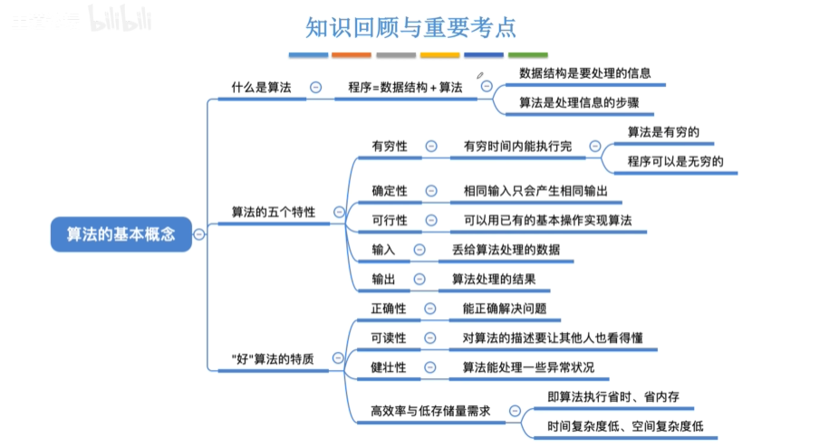

##### 算法的时间复杂度

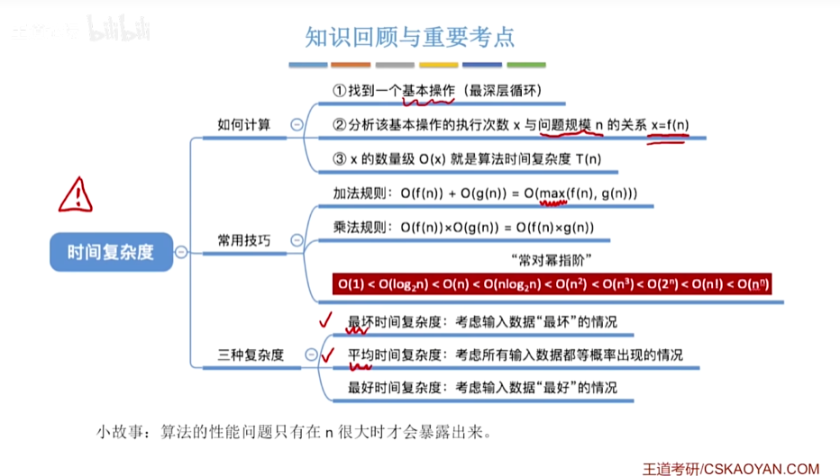

##### 算法的空间复杂度

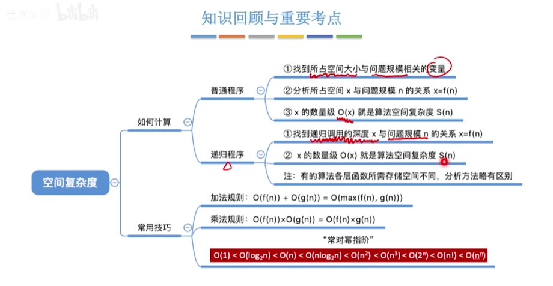

---
### 第二章 线性表(Linear List)

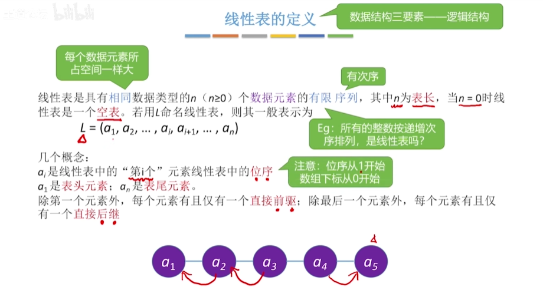
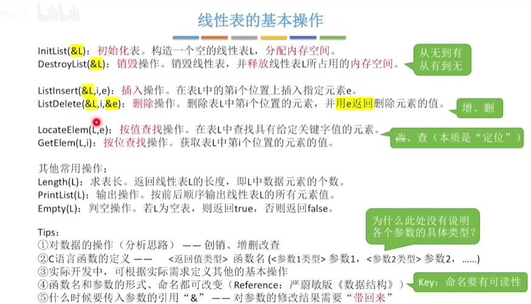

#### 顺序存储(顺序表)

静态分配的方式:大小一开始确定,不易扩展,浪费存储空间

```
// 静态分配
#include <stdio.h>
#include <stdlib.h>
// 在代码开头添加这行
#include <stdbool.h>
#define MaxSize 10

typedef struct {
    int data[MaxSize];
    int length;
}SqList;

void InitList(SqList* L) {
    for (int i = 0; i < MaxSize; i++)
    {
        L->data[i] = 0;
    }
    L->length = 0;
}

bool ListInsert(SqList* L, int i, int e) {
    if (i<1 || i>L->length + 1)
    {
        return false;
    }
    if (L->length > MaxSize)
    {
        return false;
    }
    for (int j = L->length; j >= i; j--)
    {
        L->data[j] = L->data[j - 1];
    }
    L->data[i - 1] = e;
    L->length++;
    return true;
}  //插入时间复杂度 n/2


bool ListDelete(SqList* L, int i, int *e)
{
    if (i<1 || i>L->length)
    {
        return false;
    }
    for (int j = i; j < L->length; j++)
    {
        L->data[j - 1] = L->data[j];
    }
    return true;
}
// 删除的时间复杂度(n-1)/2

// 位查找
int GetElem(SqList *L,int i)
{
    return L->data[i-1];
}

// 值查找
int LocateElem(SqList *L,int e)
{
    for(int i=0;i<L->length;i++)
    {
        if(L->data[i]==e)
        return i+1;
    }
    return 0;
}

int main() {
    SqList L;
    InitList(&L);
    // 删除示例
    if(ListDelete(L,3,e))
     print("已删除第三个元素");
    else
     print("删除不合法");
    return 0;
}
```

动态分配:
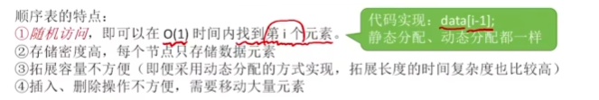

```
// 动态分配
#include <stdio.h>
#include <stdlib.h>

#define InitSize 10

typedef struct{
    int *data;
    int length;
    int MaxSize
}SeqList;

void InitList(SeqList *L){
    L->data=(int *)malloc(InitSize*sizeof(int));
    L->length=0;
    L->MaxSize=InitSize;
}

void IncreaseSize(SeqList *L,int len){
    int *p=L->data;
    L->data=(int *)malloc((L->MaxSize+len)*sizeof(int));
    for(int i=0;i<L.length;i++){
        L->data[i]=p[i];          
    }
    L->MaxSize=L->MaxSize+len;
    free(p);
}


int main(){
    SeqList L;
    InitList(&L);

    IncreaseSize(&L,5);
}
```

#### 链式存储(链表)

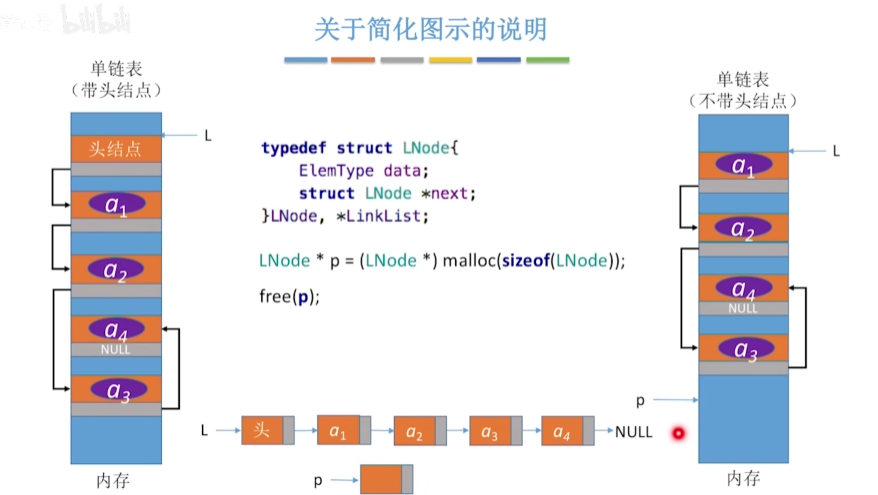

优点:不要求大片连续空间,改变容量方便
缺点:不可随机存取,要耗费一定空间存放指针

##### 不带头节点的单链表

```
typedef struct LNode{
    int data;
    struct LNode *next;
}LNode,*LinkList;

// 不带头节点的单链表
bool InitList(LinkList* L)
{
    L=NULL;  //空表,暂时没有任何节点
    return true;
}

// 指定位置插入
bool ListInsert(LinkList &L,int i,int e)
{
    if(i<1)
        return false;
    if(i==1)
    {
        LNode *s=(LNode*)malloc(sizeof(LNode));
        s->data=e;
        s->next=L;
        L=s;
        return true;
    }
    LNode *p;
    int j=1;
    p=L;
    while(p!=NULL)
        p=p->next;
        j++;
    if(p==NULL)
        return false;
    LNode *s=(LNode*)malloc(sizeof(LNode));
    s->data=e;
    s->next=p->next;
    p->next=s;
    return true;
}

bool Empty(LinkList L)
{
    if(L->next==NULL)
        return true;
    else 
        return false;
}

void test()
{
    LinkList L;  //声明一个指向单链表的指针
    InitList(&L);
}
```
==-------------------------------------------------==

***
##### 带头节点的单链表

```
typedef struct LNode{
    int data;
    struct LNode *next;
}LNode,*LinkList;

// 带头节点的单链表
bool InitList(LinkList* L)
{
    L=(LNode *)malloc(sizeof(LNode));
    if(L==NULL)
    {
        return false;
    }
    L->next=NULL;
    return true;
}

// 纯 C 规范写法(指定位置插入)
bool ListInsert(LinkList *L, int i, int e) { // 传入二级指针
    if (i < 1) return false;

    LNode *p = *L; // p 指向头结点
    int j = 0;

    // 找到第 i-1 个结点
    while (p != NULL && j < i - 1) {
        p = p->next;
        j++;
    }

    if (p == NULL) return false;

    LNode *s = (LNode *)malloc(sizeof(LNode));
    if (s == NULL) return false; // 严谨的 C 程序员会检查 malloc 是否成功

    s->data = e;
    s->next = p->next;
    p->next = s;
    
    return true;
}

bool InsertNextNode(LNode *p,int e)
{
    if(p==NULL)
        return false;
    LNode *s=(LNode*)malloc(sizeof(LNode*));
    if(s==NULL)
        return false;
    s-data=e;
    s->next=p->next;
    p->next=s;
    return true;
}

bool Empty(LinkList L)
{
    if(L->next==NULL)
        return true;
    else 
        return false;
}

bool InsertPriorNode(LNode *p,int e)
{
    if(p==NULL)
        return false;
    LNode* s=(LNode*)malloc(sizeof(LNode));
    if(s==NUll)
        return false;
    s->next=p->next;
    p->next=s;
    s->data=p->data;
    p->data=e;
    return true;
}

//删除指定位置的节点
bool ListDelete(LinkList &L,int i,int &e)
{
    if(i<1)
        return false;
    LNode *p=L;
    int j=0;
    while(p!=NULL&&j<i-1)
    {
        p=p->next;
        j++;
    }
    if(p==NULL||p->next=NULL)
        return false;
    LNode *q=p->next;
    e=q->data;
    p->next=q->next;
    free(q);
    return true;
}

//删除指定的节点
bool DeleteNode(LNode *p)
{
    if(p==NULL)
        return false;
    LNode *q=p->next;
    if(q==NULL)
        free(p);
    p->data=p->next->data;
    p-next=q->next;
    free(q);
    return true;
}

// 按位查找
LNode *GetElem(LinkList L,int i)
{
    if(i<0)
        return false;
    LNode *p;
    int j=0;
    p=L;
    while(p!=NULL&&j<i)
    {
        p=p->next;
        j++;
    }
    return p;
}

// 按值查找
LNode *LocateElem(LinkList L,int e)
{
    LNode *p=L;
    while(p->data!=e&&p!=NULL)
        p=p->next;
    return p;
}

LinkList List_TailInsert(LnkList &L)
{
    int x;
    L=(LinkList)malloc(sizeof(LNode));
    LNode *s,*r=L;
    scanf("%d",&x);
    while(x!=9999)
    {
        s=(LNode*)malloc(sizeof(LNode));

        s->data=x;
        r->next=s;
        r=s;
        scanf("%d",&x);
    }
    r->next=NULL;
    return L;
}

//头插法建立单链表
LinkList List_HeadInsert(LinkList &L)
{
    LNode *s;
    int x;
    L=(LinkList)malloc(sizeof(LNode));
    //创建头节点
    L->next=NULL;
    scanf("%d",&x);
    while(x!=9999)
    {
        s=(LNode*)malloc(sizeof(LNode));
        s->data=x;
        s->next=p->next;
        L->next=s;
        scanf("%d",&x);
    }
    return L;
}

void test()
{
    LinkList L;  //声明一个指向单链表的指针
    ListInsert(&L, i, e); // 必须取地址
    InitList(&L);
}
```

==单链表的逆置:头插法==

***
##### 双链表(带头节点)

```
typedef struct DNode
{
    int data;
    struct DNode *prior,*next;
}DNode,*DLinkList;

//双链表初始化
bool InitDLinkList(DLinkList &L)
{
    L=(DLinkList)malloc(sizeof(DNode));
    if(L==NULL)
        return false;
    L->prior=NULL;
    L->next=NULL;
    return true;
}

//双链表的插入(在p节点之后插入s节点)
bool InsertNextDNode(DNode *p,DNode *s)
{
    if(p==NULL||s==NULL)
        return false;
    s->next=p->next;
    if(p->next==NULL)
        p->next->prior=s;
    s->prior=p;
    p->next=s;
}

// 删除p节点的后继节点
bool DeleteNextDNode(DNode *p)
{
    if(p==NULL) return false;
    DNode *q=p->next;
    if(q==NULL) return false;
    p->next=q->next;
    if(q->next!=NULL)
        q->next->prior=p;
    free(q);
    return true;
}

//双链表的销毁
void DestoryList(DLinkList &L)
{
    while(L->next!=NULL)
        DeleteNextDNode(L);
    free(L);
    L=NULL;
}

bool Empty(DLinkList L)
{
    if(L->next==NULL)
        return true;
    else
        return false;
}

void testDLinkList()
{
    DLinkList L;
    InitDLinklist(L);

}
```
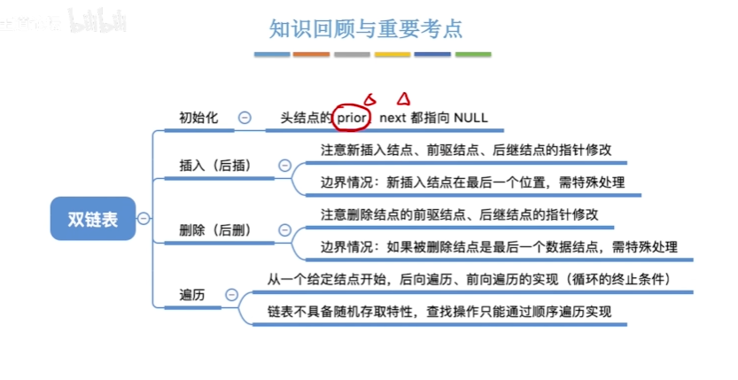

***
##### 循环链表

循环单链表

```
typedef struct LNode
{
    int data;
    struct LNode *next;
}LNode,*LinkList;

bool Empty(LinkList L)
{
    if(L->next==L)
        return true;
    else
        return false;
}

//判断p节点是否为循环单链表的表尾
bool isTail(LinkList L,LNode *p)
{
    if(L->next==L)
        return true;
    else
        return false;
}

bool InitList(LinkList &L)
{
    L+(LNode *)malloc(sizeof(LNode));
    if(L==NULL)
        return false;
    L->next=L;
    return false;
}
```

***
循环双链表

```
typedef struct DNode
{
    int data;
    struct DNode *prior,*next;
}DNode,*DLinklist;

bool InsertNextDNode(DNode *p,DNode *s)
{
    //将s节点插入到p节点之后
    s->next=p->next;
    p->next->prior=s;
    s->prior=p;
    p->next=s;
}

//删除p的后继节点q
p->next=q->next;
q->next->prior=p;
free(q);

bool Empty(DLinklist L)
{
    if(L->next==L)
        return true;
    else
        return false;
}

bool isTail(DLinklist L,DNode *p)
{
    if(p->next==L)
        return true;
    else
        return false;
}


bool InitDLinkList(DLinklist &L)
{
    L=(DNode *)malloc(sizeof(DNode));
    if(L==NULL)
        return false;
    L->prior=L;
    L->next=L;
    return true;
}

bool testDLinkList()
{
    DLinklist L;
    InitDLinkList(L);
}
```

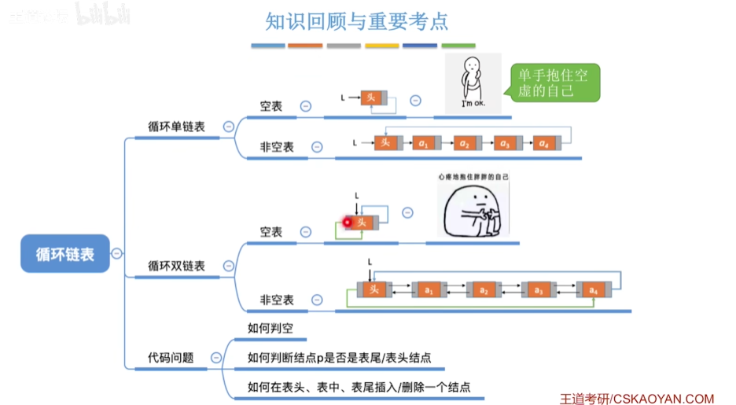

***
##### 静态链表

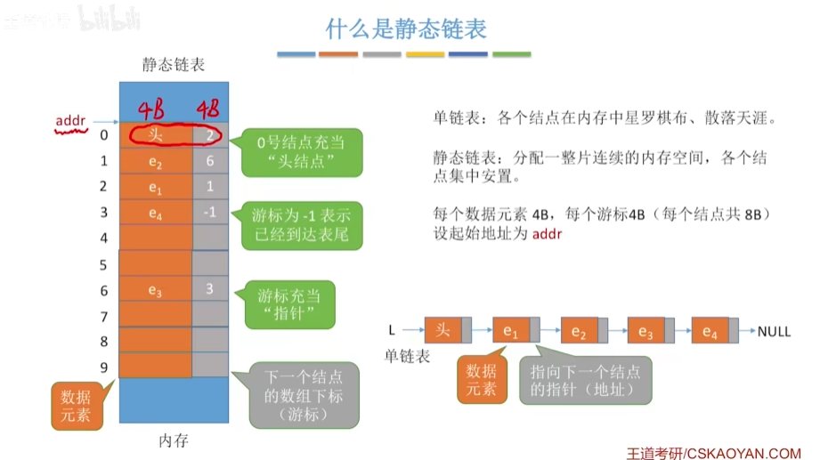
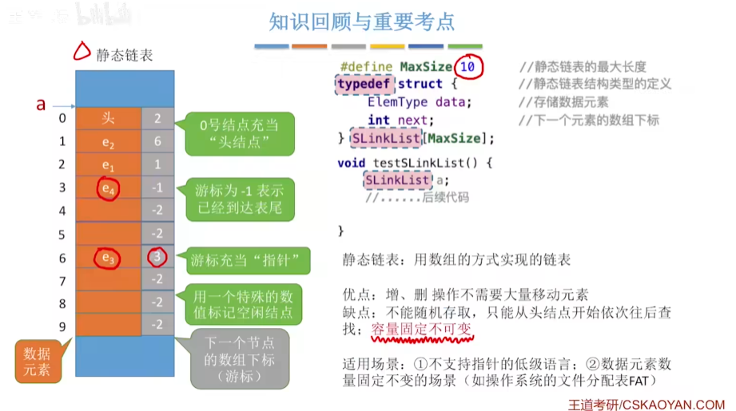
把为空的节点设为-2

```
#define MaxSize 10
typedef struct
{
    int data;
    int next;
}SLinkList[MaxSize];

void testSLinkList()
{
    SLinkList a;
    //......后续代码
}
```
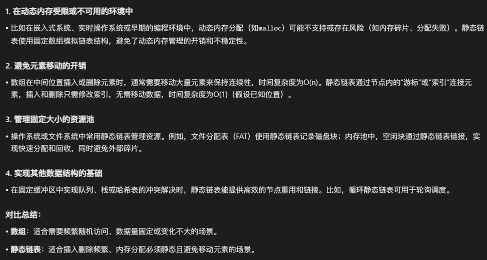

***
##### 顺序表vs链表
ψ(｀∇´)ψ
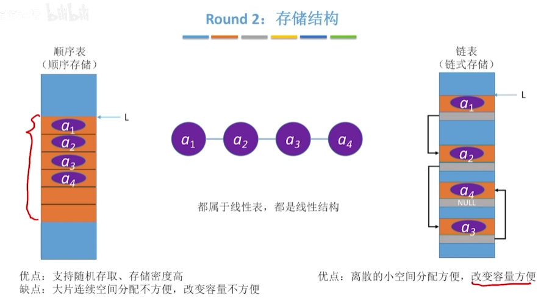


***
### 栈和队列
＼＼\\٩( 'ω' )و //／／

#### 栈

栈的定义和基本操作:
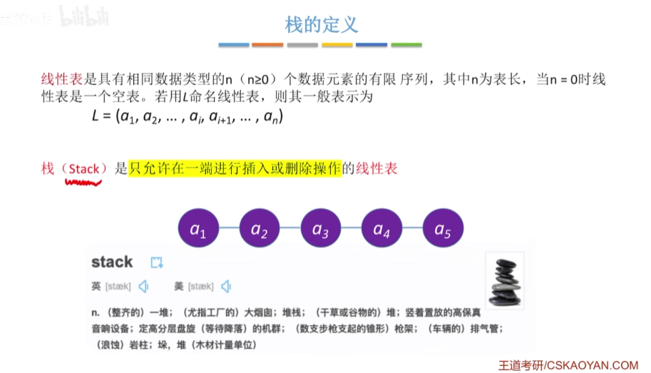
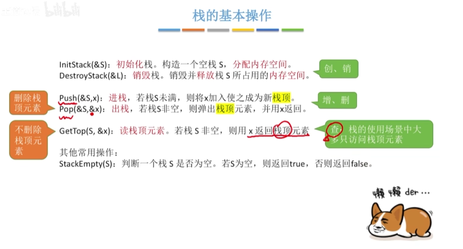

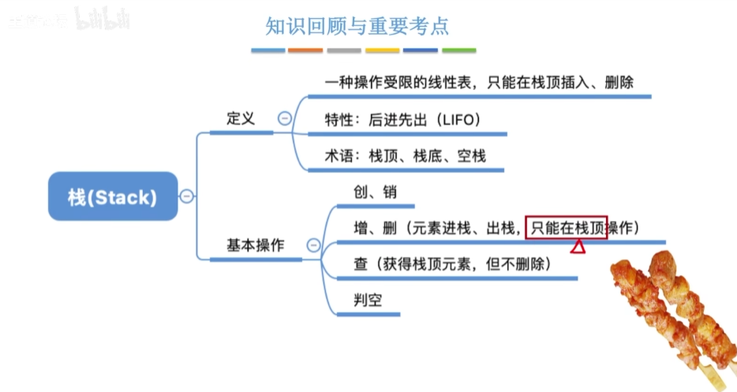

##### 顺序栈
```
#define MaxSize 10
typedef struct
{
    int data[MaxSize];
    int top;
}SqStack;

void InitStack(SqStack &S)
{
    S.top=-1;
}

bool StackEmpty(SqStack S)
{
    if(S.top==-1)
        return true;
    else
        return false;
}

bool Push(SqStack &s,int x)
{
    if(S.top==MaxSize-1)
        return false;
    S.data[++S.top]=x;
    return true;
}

bool Pop(SqStack &S,int &x)
{
    if(S.top==-1)
        return false;
    x=S.data[S.top];
    S.top=S.top-1;
    return true;
}

bool GetTop(SqStack S,int &x)
{
    if(S.top==-1)
        return false;
    x=S.data[S.top];
    return true;
}

void testStack()
{
    SqStack S;
    InitStack(S);
}
( ✌︎'ω')✌︎
```
提高内存空间的利用率
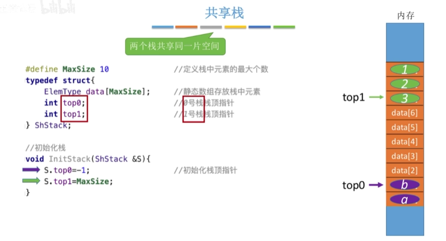
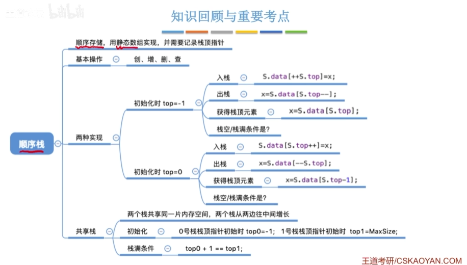

***
##### 链栈

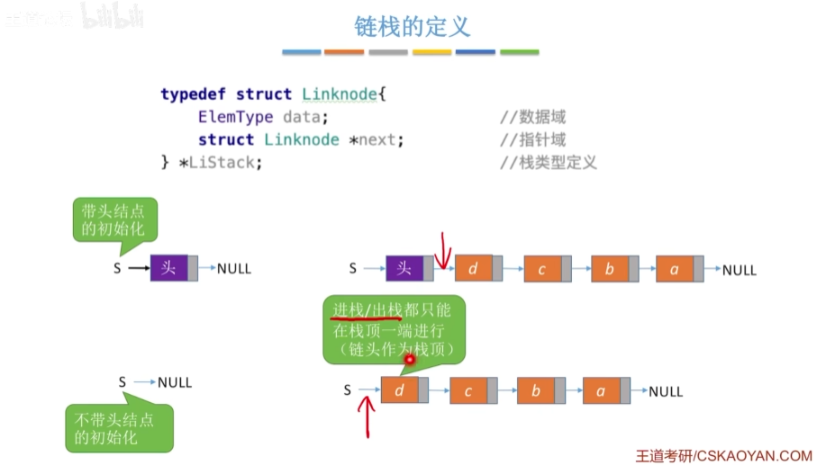
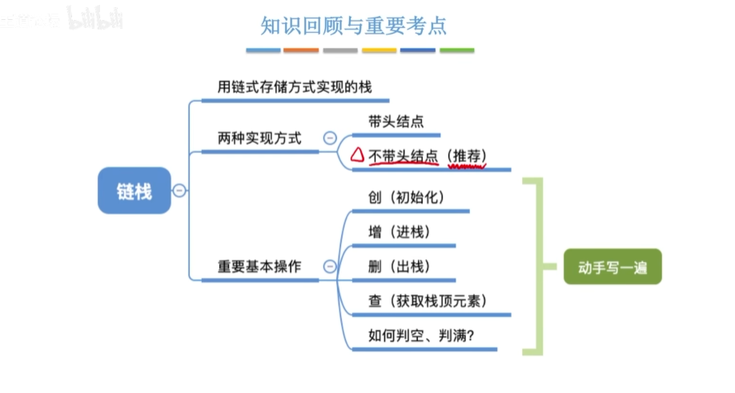

```
#include <stdio.h>
#include <stdlib.h>
#include <stdbool.h>

// 定义链栈节点结构
typedef struct StackNode {
    int data;                   // 数据域（这里以int为例）
    struct StackNode* next;     // 指针域，指向下一个节点
} StackNode;

// 链栈结构（不带头节点）
typedef struct {
    StackNode* top;     // 栈顶指针
    int size;           // 栈中元素个数（可选）
} LinkedStack;

// 1. 初始化链栈
void InitStack(LinkedStack* S) {
    S->top = NULL;      // 栈顶指针置空
    S->size = 0;        // 栈大小为0
}

// 2. 判断栈是否为空
bool IsEmpty(LinkedStack* S) {
    return S->top == NULL;
    // 或者：return S->size == 0;
}

// 3. 进栈操作（入栈）
bool Push(LinkedStack* S, int value) {
    // 创建新节点
    StackNode* newNode = (StackNode*)malloc(sizeof(StackNode));
    if (newNode == NULL) {
        printf("内存分配失败！\n");
        return false;   // 内存不足，入栈失败
    }
    
    newNode->data = value;          // 存储数据
    newNode->next = S->top;         // 新节点指向原栈顶
    S->top = newNode;               // 栈顶指针指向新节点
    S->size++;                      // 栈大小加1
    
    return true;
}

// 4. 出栈操作
bool Pop(LinkedStack* S, int* value) {
    if (IsEmpty(S)) {
        printf("栈为空，无法出栈！\n");
        return false;
    }
    
    StackNode* temp = S->top;       // 临时保存栈顶节点
    *value = temp->data;            // 获取栈顶元素值
    S->top = temp->next;            // 栈顶指针指向下一个节点
    free(temp);                     // 释放原栈顶节点
    S->size--;                      // 栈大小减1
    
    return true;
}

// 5. 获取栈顶元素（不删除）
bool GetTop(LinkedStack* S, int* value) {
    if (IsEmpty(S)) {
        printf("栈为空，无栈顶元素！\n");
        return false;
    }
    
    *value = S->top->data;          // 直接读取栈顶元素
    return true;
}

// 6. 遍历链栈（从栈顶到栈底）
void TraverseStack(LinkedStack* S) {
    if (IsEmpty(S)) {
        printf("栈为空！\n");
        return;
    }
    
    printf("栈中元素（栈顶->栈底）: ");
    StackNode* current = S->top;
    while (current != NULL) {
        printf("%d ", current->data);
        current = current->next;
    }
    printf("\n");
}

// 7. 销毁链栈
void DestroyStack(LinkedStack* S) {
    int value;
    while (!IsEmpty(S)) {
        Pop(S, &value);     // 逐个出栈释放
    }
    S->size = 0;
}

// 8. 获取栈的大小
int StackSize(LinkedStack* S) {
    return S->size;
}

// 测试函数
int main() {
    LinkedStack S;
    
    printf("========== 链栈测试 ==========\n");
    
    // 1. 初始化栈
    InitStack(&S);
    printf("初始化完成，栈是否为空: %s\n", IsEmpty(&S) ? "是" : "否");
    
    // 2. 入栈操作
    printf("\n执行入栈操作:\n");
    for (int i = 1; i <= 5; i++) {
        Push(&S, i * 10);
        printf("入栈: %d\n", i * 10);
    }
    printf("当前栈大小: %d\n", StackSize(&S));
    TraverseStack(&S);
    
    // 3. 获取栈顶元素
    int topValue;
    if (GetTop(&S, &topValue)) {
        printf("栈顶元素: %d\n", topValue);
    }
    
    // 4. 出栈操作
    printf("\n执行出栈操作:\n");
    while (!IsEmpty(&S)) {
        Pop(&S, &topValue);
        printf("出栈: %d\n", topValue);
        printf("当前栈大小: %d\n", StackSize(&S));
        TraverseStack(&S);
    }
    
    // 5. 再次测试空栈操作
    printf("\n测试空栈操作:\n");
    GetTop(&S, &topValue);  // 应该提示栈为空
    
    // 6. 销毁栈
    DestroyStack(&S);
    printf("\n栈已销毁，程序结束。\n");
    
    return 0;
}
```

***
#### 队列

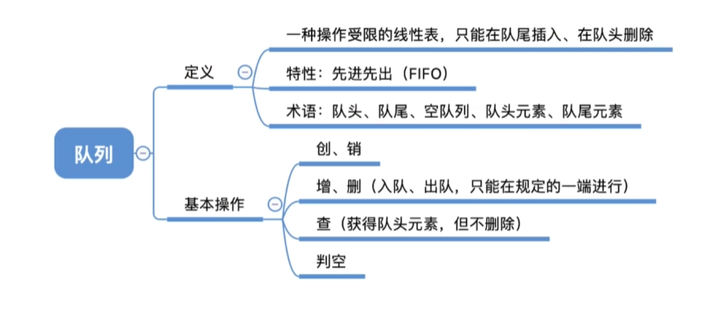
