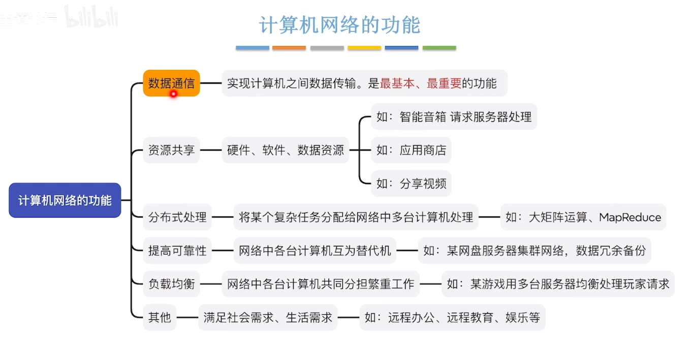

#### 计算机网络的概念

- 计算机网络

集线器同时发送数据时容易发生数据冲突

交换机解决了数据冲突的问题
==集线器和交换机连接不同的计算机形成计算机网络==

- 互连网

==由路由器连接不同的计算机网络形成互连网==

- 互联网

总结：

***

#### 计算机网络的组成和功能

- 计算机网络的组成
  - 组成部分来看
  
  - 工作方式来看
  
  
  - 逻辑功能来看
  
  

总结：

- 计算机网络的功能

***

#### 电路交换，报文交换，分组交换

- 电路交换

==无差错控制，灵活性差==

- 报文交换

- 分组交换
